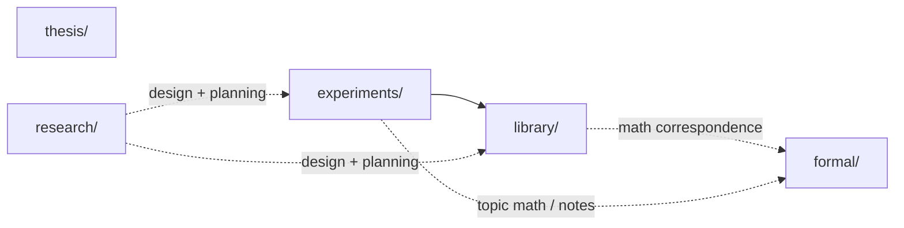

<!--
Purpose: repo-level component and code-architecture map for humans and agents.
Context: this file describes the current component structure first. It is not a
progress tracker, migration plan, or data-catalog policy note. For the fact
base behind this file, see `research/repo-maintainability/design/repo-facts.md`.
-->

# ARCHITECTURE.md

## What This File Is

This file describes the current code/component architecture of the repo.

It answers these recurring high-level questions:

- which repo areas own which kinds of code and mathematics
- how `library/`, `experiments/`, `formal/`, `thesis/`, and `research/` relate
- what the current library-facing API tiers look like for experiment code
- what topic helper crates currently are and are not
- which boundaries are clear today and which are still open design questions

This file is current-state-first. If the repo is transitional, the document
should say so explicitly rather than smoothing it into a cleaner target state.

This file is not:

- a progress tracker
- a decision-history log
- a broad placement-rules manual
- a detailed data-flow catalog
- a replacement for local file/module headers

For those other surfaces:

- `AGENTS.md`: short repo map, operating rules, quick commands
- `DATAFLOW.md`: dataset classes, producer/consumer structure, cache roles
- `TASKS.md`: active work and resume points
- `research/repo-maintainability/design/*.md`: discovery notes and open design
  questions

## How To Read And Update This File

### Writing rules

- Prefer current-state description over cleanup proposals.
- Cite stable surfaces such as file paths, section headers, Rust symbols, and
  formal labels rather than brittle line references when possible.
- Keep this file at the boundary level. Local implementation details belong in
  local file headers.
- If a statement depends on a still-open architecture choice, mark it as open
  instead of promoting it to a fact.

### Freshness rules

- If code or docs contradict this file, either update this file or mark the
  section `stale`.
- If a component boundary changes, update this file together with the affected
  local headers or top-level docs.
- If this file starts duplicating detailed local docs, delete the duplicate
  prose and link outward instead.

### Diagram rules

- Use Mermaid when the component graph is clearer visually than in bullets.
- Keep each graph small enough that the raw source remains readable in Git
  diff.

## Status

- State: first current-state pass.
- Last updated: 2026-04-16.
- Source note: [repo-facts.md](/workspaces/msc-math/research/repo-maintainability/design/repo-facts.md:1).
- Known limit: API tiering and helper boundaries are partly descriptive today
  and partly still open design questions.

## Component Boundaries

| Area | Current role | Notes |
| --- | --- | --- |
| `library/` | reusable Rust crate `symplectic` | small root reexport surface; larger practical expert-facing surface through deeper public modules |
| `experiments/` | topic-grouped experiment packages, binaries, analyses, and local helper crates | exploratory algorithms start here; slow validation and broad sweeps stay here |
| `formal/` | developer-facing mathematics for library and experiments | supports math/code correspondence; not thesis input |
| `thesis/` | self-contained publication artifact | must not depend on runtime links into `library/`, `formal/`, or `experiments/` |
| `research/` | design/program notes and experiment-planning material | architecture-program discovery notes live here |

## Dependency Direction

Current high-level dependency structure:

Current boundary facts:

- Experiment code imports `symplectic` directly.
- `library/src/lib.rs` already documents library-internal submodule boundaries
  and dependency direction.
- `formal/` is the developer-facing math layer for nontrivial algorithms.
- `research/` stores planning and design notes, not runtime code.
- `thesis/` is intentionally publication-owned and self-contained.
- `thesis/` must not depend on runtime links into `library/`, `experiments/`,
  or `formal/`.

## Library API Tiers

Current observed API tiers for experiment code:

| Tier | Current meaning | Examples |
| --- | --- | --- |
| simple public | short root reexports in `library/src/lib.rs` | `symplectic::ehz_capacity`, `symplectic::volume`, `symplectic::omega0`, `symplectic::lagrangian_product` |
| expert public | deeper public modules used as normal experiment APIs | `symplectic::database`, `symplectic::random`, `symplectic::derivatives`, `symplectic::kkt::saddle_point_solver`, `symplectic::algorithms::facet_adjacency` |
| unclear | public paths whose long-term experiment-facing status is not yet explicit | `symplectic::algorithms::hk2017::orbit_recovery`, `symplectic::algorithms::billiard::facet_classification`, `symplectic::kkt::qp_assembly::build_augmented_system` |
| accidental internal | public-in-practice helpers that experiments currently reach through | `symplectic::algorithms::hk2017::permutations::for_each_cyclic_permutation` |

Current architectural fact: the practical experiment-facing library surface is
larger than the short root reexport surface.

## Experiment Helper Crates And Per-Binary Code

Topic helper crates already exist at:

- `experiments/combinatorial-cells/src/lib.rs`
- `experiments/hko-local-maximum/src/lib.rs`
- `experiments/numerics/gradient/src/lib.rs`
- `experiments/sys-landscape/src/lib.rs`

Current observed pattern:

- topic helper crates exist as the natural place for shared experiment-local
  code
- some topic helper crates are still thin
- some shared logic is still copied across binaries instead of being extracted

Current helper families recorded in discovery:

| Helper family | Current shape |
| --- | --- |
| step-bound event logic | repeated across sys-landscape and combinatorial-cells; common logic already has a shared home candidate in `experiments/sys-landscape/src/lib.rs` |
| sys quotient / ascent scaffold | arithmetic repeats across multiple ascent binaries, while backend policy still varies per binary |
| orbit-enumeration wrappers | repeated in numerics binaries while `experiments/numerics/gradient/src/lib.rs` remains mostly empty |
| solver instrumentation helpers | shared core exists, but result payloads differ enough that the boundary is still open |

## Documentation And Math Surfaces

Current documentation split:

- `AGENTS.md` owns the short repo map and always-loaded operating rules.
- `ARCHITECTURE.md` owns repo-level component boundaries and API-tier summary.
- `DATAFLOW.md` owns dataset classes and producer/consumer structure.
- local `src/lib.rs` headers own package-local intent and local architecture.
- `formal/` owns developer-facing mathematics and formal labels for
  math-code correspondence.
- `TASKS.md` and `research/.../design/*.md` own active planning, discovery, and
  open design questions.

Current architectural fact: repo orientation already exists in several places,
but before this session there was no dedicated repo-level architecture file.

## Current Tensions And Open Edges

- The simple root library surface is smaller than the surface experiments
  actually use.
- Topic helper crates exist, but extraction is incomplete.
- Some missing explanations are doc gaps; others are real unresolved boundary
  questions.
- The current file does not yet settle whether some deep public paths are
  intended expert surfaces or accidental internals.

## Target-State Questions

These are open questions, not current architecture facts:

- Which deep public paths should remain supported experiment-facing imports?
- Which repeated helpers belong in topic helper crates versus `library/`?
- Should experiment code standardize more strongly on root reexports, or is the
  deep expert-public form acceptable during the thesis push?
