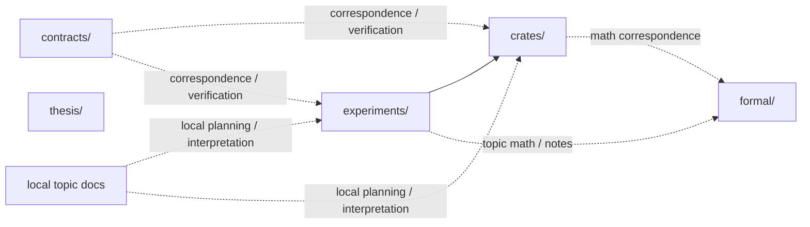
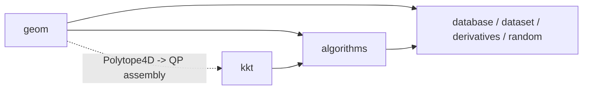
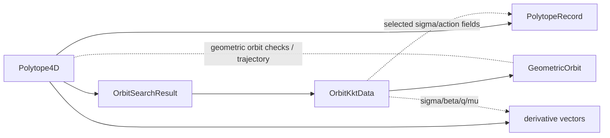
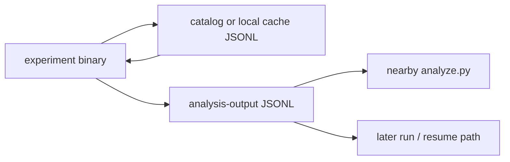

<!--
Purpose: repo-level component and code-architecture map for humans and agents.
Context: this file describes the current component structure first. It is not a
progress tracker or migration plan. For the fact base behind this file, see
`TASKS.md`, `AGENTS.md`, and the local topic docs under `experiments/**`.
It answers these recurring questions:
- which repo areas own which kinds of code and mathematics
- how `crates/`, `experiments/`, `formal/`, `contracts/`, and `thesis/` relate
- which core entities and result containers recur across the repo
- what the current crate-facing API tiers look like for experiment code
- what topic helper crates currently are and are not
- how persisted polytope/cache/output data currently fits into the architecture
- which boundaries are clear today and which are still open design questions
Writing/update rules:
- prefer current-state description over cleanup proposals
- cite stable surfaces such as file paths, section headers, Rust symbols, and
  formal labels rather than brittle line references when possible
- keep this file at the boundary level; local implementation details belong in
  local file headers
- if a statement depends on a still-open architecture choice, mark it as open
  instead of promoting it to a fact
Freshness rules:
- if code or docs contradict this file, either update this file or mark the
  section `stale`
- if a component boundary changes, update this file together with the affected
  local headers or top-level docs
- if this file starts duplicating detailed local docs, delete the duplicate
  prose and link outward instead
Diagram rule:
- use Mermaid when the component graph is clearer visually than in bullets, but
  keep each graph small enough that the raw source remains readable in Git diff
-->

# ARCHITECTURE.md

## Status

- State: first current-state pass.
- Last updated: 2026-04-16.
- Source note: current-state migration pass in `layout-migration`.
- Known limits:
  - API tiering and helper boundaries are partly descriptive today and partly
    still open design questions.
  - Shared-catalog path policy is still open even though the current mirror
    cluster is documented here.

## Component Boundaries

| Area | Current role | Notes |
| --- | --- | --- |
| `crates/` | durable Rust crates | `crates/symplectic/` owns the main symplectic implementation; `crates/algebraic-numbers/` owns exact ordered algebraic scalar arithmetic |
| `experiments/` | topic-grouped experiment packages, binaries, analyses, and local helper crates | exploratory algorithms start here; slow validation and broad sweeps stay here |
| `formal/` | developer-facing mathematics for crates and experiments | supports math/code correspondence; not thesis input |
| `contracts/` | canonical algorithm correspondence and verification contracts | cross-surface metadata for important algorithms |
| `thesis/` | self-contained publication artifact | must not depend on runtime links into `crates/`, `formal/`, or `experiments/` |
| local topic docs | local `README.md`, `RESEARCH.md`, and `PLAN-<goal>.md` files | exploratory and planning notes stay near the code or experiment they describe |

## Dependency Direction

Current high-level dependency structure:

Current boundary facts:

- Experiment code imports `symplectic` directly.
- `crates/symplectic/src/lib.rs` already documents crate-internal submodule boundaries
  and dependency direction.
- `formal/` is the developer-facing math layer for nontrivial algorithms.
- `contracts/` stores canonical cross-surface algorithm metadata.
- Local `RESEARCH.md` / `PLAN-<goal>.md` files store planning and design notes,
  not runtime code.
- `thesis/` is intentionally publication-owned and self-contained.
- `thesis/` must not depend on runtime links into `crates/`, `experiments/`,
  or `formal/`.

## Library Subsystems

Current library-internal subsystem split:

| Subsystem | Current role | Notes |
| --- | --- | --- |
| `geom` | single-polytope geometry layer | owns `Polytope4D`, exact/rational geometry utilities, symplectic form helpers, volume/facet helpers, constructors, and related geometry routines |
| `kkt` | context-free constrained-QP solver layer | operates on abstract matrices `(C, d, H)`; `qp_assembly` is the main crossing point from polytope geometry into solver inputs |
| `algorithms` | symplectic/capacity algorithm layer | owns HK2017, billiard, shared capacity-accumulator logic, and related pruning/combinatorics |
| `database` / `dataset` | persistence/schema support layer | owns JSONL storage helpers and row schemas |
| `derivatives` | differential support layer | analytical derivatives with respect to dual vertices `a_i` |
| `random` | sampling/generation support layer | seeded random polytope generation for experiments |

Current high-level library shape:

Agent-facing navigation shortcuts:

| If you need... | Start here |
| --- | --- |
| geometry of one polytope | `geom` |
| one orbit candidate / KKT solve | `kkt` |
| capacity computation | `algorithms` |
| recovered primal orbit / trajectory | `algorithms::hk2017::orbit_recovery` |
| derivatives with respect to dual vertices | `derivatives` |
| JSONL polytope caches and stored records | `database` |

## Core Entities And Transformations

Current recurring code-level entities:

| Entity | Current role | Main surface |
| --- | --- | --- |
| `Polytope4D` | central polytope object for geometry and algorithms | `library/src/lib.rs`, `geom` |
| `OrbitSearchResult` | shared capacity/orbit search result returned by the root `ehz_capacity`, `ehz_capacity_pruned`, `ehz_capacity_unpruned`, and `ehz_capacity_billiard` family; contains the orbit list plus `min_action` bounds and iterations | `library/src/algorithms/orbit_search.rs`, `library/src/lib.rs` |
| `OrbitKktData` | one solved orbit payload: `sigma`, `beta`, action interval, `q`, optional multipliers, admissibility | `library/src/algorithms/orbit_search.rs` |
| `GeometricOrbit` | recovered geometric trajectory/orbit data derived from an `OrbitKktData` payload | `library/src/algorithms/hk2017/orbit_recovery.rs` |
| `PolytopeRecord` | persisted JSONL row, including optional `Source` provenance and optional `SigmaAction` orbit summaries | `library/src/database.rs` |

Current observed transformation chain:

Important current-state nuance:

- The repo currently has two orbit-side layers:
  - `OrbitSearchResult` / `OrbitKktData` for the shared root search output
  - `GeometricOrbit` for recovered geometric trajectories and verification data
- `recover_and_verify(polytope, &orbit)` is a real library-level
  transformation from solved orbit payload to recovered orbit.
- The derivatives layer is lower-level: experiments call
  `capacity_derivatives_a(...)` and `volume_derivatives_a(polytope)` directly.
- Capacity derivatives currently consume orbit/KKT ingredients such as
  `beta`, `sigma`, `q`, and `mu`; there is no dedicated
  derivatives object.
- Persisted `sigmas` in `PolytopeRecord` are summary data for reuse/caching, not
  a full replacement for `GeometricOrbit`.
- There is not yet a single top-level library API of the form
  `OrbitSearchResult -> derivatives object`.

## Library API Tiers

Current observed API tiers for experiment code:

| Tier | Current meaning | Examples |
| --- | --- | --- |
| simple public | short root reexports and trivial preset routers in `library/src/lib.rs` | `symplectic::ehz_capacity`, `symplectic::ehz_capacity_pruned`, `symplectic::ehz_capacity_unpruned`, `symplectic::ehz_capacity_billiard`, `symplectic::OrbitSearchResult`, `symplectic::volume`, `symplectic::omega0`, `symplectic::lagrangian_product` |
| expert public | deeper modules and building blocks used by experiments that need non-default control | `symplectic::database`, `symplectic::random`, `symplectic::derivatives`, `symplectic::algorithms::solve_orbit_sigma`, `symplectic::algorithms::aggregate_orbits`, `symplectic::algorithms::hk2017`, `symplectic::algorithms::billiard`, `symplectic::kkt::saddle_point_solver`, `symplectic::algorithms::facet_adjacency` |
| unclear | public paths whose long-term experiment-facing status is not yet explicit | `symplectic::algorithms::hk2017::orbit_recovery`, `symplectic::algorithms::billiard::facet_classification`, `symplectic::kkt::qp_assembly::build_augmented_system` |
| accidental internal | public-in-practice helpers that experiments currently reach through | `symplectic::algorithms::hk2017::permutations::for_each_cyclic_permutation` |

Current architectural fact: the practical experiment-facing library surface is
larger than the short root reexport surface.

## Experiment Helper Crates And Per-Binary Code

Topic helper crates already exist at:

- `experiments/combinatorial-cells/src/lib.rs`
- `experiments/hko-local-maximum/src/lib.rs`
- `experiments/numerics/gradient/src/lib.rs`
- `experiments/sys-landscape/src/lib.rs`

Current observed pattern:

- topic helper crates exist as the natural place for shared experiment-local
  code
- some topic helper crates are still thin
- some shared logic is still copied across binaries instead of being extracted

Current helper families recorded in discovery:

| Helper family | Current shape |
| --- | --- |
| step-bound event logic | repeated across sys-landscape and combinatorial-cells; common logic already has a shared home candidate in `experiments/sys-landscape/src/lib.rs` |
| sys quotient / ascent scaffold | arithmetic repeats across multiple ascent binaries, while backend policy still varies per binary |
| orbit-enumeration wrappers | repeated in numerics binaries while `experiments/numerics/gradient/src/lib.rs` remains mostly empty |
| solver instrumentation helpers | shared core exists, but result payloads differ enough that the boundary is still open |

## Persisted Records And Data Products

Current storage/persistence architecture:

- `library/src/database.rs` provides JSONL storage machinery.
- Callers choose paths and path policy; the storage layer does not define a
  canonical mutable shared cache path.
- `PolytopeRecord` stores defining rational geometry plus optional computed
  fields such as `source`, `volume`, `capacity`, `sigma_gap_cutoff`, and
  `sigmas`.

Current observed persisted-data classes:

| Class | Current meaning |
| --- | --- |
| shared polytope catalog rows | reusable polytope records with dual vertices, vertices, source, volume, capacity, and best-sigma-style data |
| mirror catalogs | byte-identical copies of the same shared catalog content in different experiment areas |
| topic-local transient caches | local caches that store intermediate search states and are not intended as shared catalogs |
| analysis outputs | experiment-owned JSONL files consumed by nearby `analyze.py` scripts |
| resume artifacts | outputs that also serve as later-run inputs or resume sources |

Current observed shared-catalog mirror cluster:

| Path | Current observed role |
| --- | --- |
| `experiments/combinatorial-cells/polytopes.jsonl` | shared-catalog candidate currently read and written within combinatorial-cells |
| `experiments/sys-landscape/cache.jsonl` | mirror candidate |
| `experiments/verification/orbit-recovery/polytopes.jsonl` | mirror candidate |

Observed fact:

- These three files were byte-identical on 2026-04-16.
- Shared SHA-256:
  `8679b89763a10bf1380410f288845f03bcdc8e365035aa31235ff00c9cc07363`
- Byte identity is an observation, not yet a settled canonical-path policy.

Current local-cache exception:

- `experiments/sys-landscape/variable-f-ascent/cache.jsonl` is intentionally
  local and stores intermediate search states rather than acting as part of the
  shared catalog.

Current producer/consumer shape:

Current fragile consumer assumptions:

- Some experiment code trusts cached `capacity`.
- Some fast paths also trust `sigmas.first().perm`.
- Some analyzers depend on stable `source` conventions.
- Some outputs are only useful if the row schema stays aligned with the nearby
  analyzer.

## Representation And Numerics Boundary

Current boundary between exact-style data and floating computations:

- Defining polytope geometry is stored and keyed in rational form in
  `PolytopeRecord`.
- `geom` includes exact/rational utilities such as rational arithmetic and
  vertex enumeration.
- Many algorithmic computations run in `f64`, including:
  - capacity algorithms on the normal hot path
  - orbit recovery
  - derivatives
  - volume via qhull-backed floating computation
- `kkt::rational_solver` exists as an exact-validation track, not as the main
  capacity hot path.
- Persisted records sit across this boundary: rational geometry plus optional
  floating computed fields like `volume`, `capacity`, and `sigmas`.

Architecturally, this means:

- “exact polytope identity” and “floating algorithm output” are intentionally
  not the same layer
- experiments often move from rationally identified polytopes to floating
  computation and then back to persisted summary fields
- many confusing edges in the repo are representation-boundary issues rather
  than algorithm-boundary issues

## Documentation And Math Surfaces

Current documentation split:

- `AGENTS.md` owns the short repo map and always-loaded operating rules.
- `ARCHITECTURE.md` owns repo-level component boundaries, entity-level summary,
  API-tier summary, and the high-level persisted-data architecture.
- local `src/lib.rs` headers own package-local intent and local architecture.
- `formal/` owns developer-facing mathematics and formal labels for
  math-code correspondence.
- `TASKS.md` and `research/.../design/*.md` own active planning, discovery, and
  open design questions.

Current architectural fact: repo orientation already exists in several places,
but before this session there was no dedicated repo-level architecture file.

## Current Tensions And Open Edges

- The simple root library surface is smaller than the surface experiments
  actually use.
- Topic helper crates exist, but extraction is incomplete.
- The repo has a clean observed mirror cluster, but not yet an explicit
  canonical-path policy.
- Some missing explanations are doc gaps; others are real unresolved boundary
  questions.
- The current file does not yet settle whether some deep public paths are
  intended expert surfaces or accidental internals.

## Target-State Questions

These are open questions, not current architecture facts:

- Which deep public paths should remain supported experiment-facing imports?
- Which repeated helpers belong in topic helper crates versus `library/`?
- Which path, if any, should become the explicitly canonical shared polytope
  catalog?
- Which reusable stored fields should downstream consumers be allowed to trust
  as a stable cache contract?
- Should experiment code standardize more strongly on root reexports, or is the
  deep expert-public form acceptable during the thesis push?
