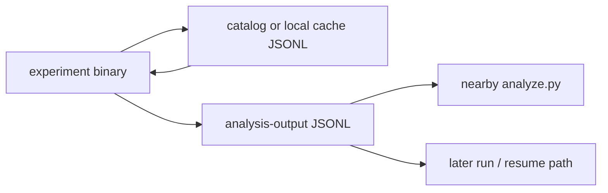

<!--
Purpose: repo-level data-flow and data-product map for humans and agents.
Context: this file describes the current dataset and output structure first. It
does not settle the canonical-cache policy unless the repo already states it.
For the fact base behind this file, see
`research/repo-maintainability/design/repo-facts.md` and
`research/repo-maintainability/design/data-flow-inventory.md`.
-->

# DATAFLOW.md

## What This File Is

This file describes the current experiment data flow and dataset structure of
the repo.

It answers these recurring questions:

- what kinds of datasets and JSONL files exist
- which files behave like shared catalogs, mirrors, transient caches, or
  analysis outputs
- how experiment binaries, local analyzers, and resume flows relate
- which fields current consumers rely on
- where the current policy is descriptive only and where it is still open

This file is current-state-first. It should describe the committed data layout
as observed today, not the layout we may refactor toward later.

This file is not:

- a regeneration log
- a tracker for experiment status
- a promise that one current mirror path is the permanent canonical source
- a replacement for local experiment headers or analyzer comments

## How To Read And Update This File

### Writing rules

- Describe observed producer/consumer structure before proposing cleanup.
- Keep storage machinery separate from policy: `library/src/database.rs`
  explains the machinery, while this file explains how the repo currently uses
  it.
- Record trusted fields and fragile fast paths where consumers depend on them.
- If a path role is undecided, mark it as open instead of guessing.

### Freshness rules

- If committed JSONL paths or consumer assumptions change, update this file in
  the same session.
- If a section becomes stale and cannot be refreshed immediately, mark it
  `stale` with the reason.
- Do not edit tracked `.jsonl` files just to make this document cleaner.

### Diagram rules

- Use Mermaid for the producer/consumer graphs.
- Prefer a few small graphs over one large all-repo graph.

## Status

- State: first current-state pass.
- Last updated: 2026-04-16.
- Source notes:
  - [repo-facts.md](/workspaces/msc-math/research/repo-maintainability/design/repo-facts.md:1)
  - [data-flow-inventory.md](/workspaces/msc-math/research/repo-maintainability/design/data-flow-inventory.md:1)
- Known limit: canonical-vs-mirror policy is still open.

## Data Product Classes

Current data/product classes observed in the repo:

| Class | Current meaning |
| --- | --- |
| shared polytope catalog rows | reusable polytope records with dual vertices, vertices, source, volume, capacity, and best-sigma-style data |
| mirror catalogs | byte-identical copies of the same shared catalog content in different experiment areas |
| topic-local transient caches | local caches that store intermediate search states and are not intended as shared catalogs |
| analysis outputs | experiment-owned JSONL files consumed by nearby `analyze.py` scripts |
| resume artifacts | outputs that also serve as later-run inputs or resume sources |

## Storage Layer Versus Path Policy

Current split:

- `library/src/database.rs` provides the JSONL storage machinery.
- Callers choose paths and path policy.
- The storage layer does not define a canonical mutable shared cache path.
- `PolytopeRecord` treats `dual_vertices_rational` and `vertices_rational` as
  defining data, with optional later-filled fields such as `source`, `volume`,
  `capacity`, `sigma_gap_cutoff`, and `sigmas`.

## Shared Catalog And Mirrors

Current observed shared-catalog cluster:

| Path | Current observed role |
| --- | --- |
| `experiments/combinatorial-cells/polytopes.jsonl` | shared-catalog candidate currently read and written within combinatorial-cells |
| `experiments/sys-landscape/cache.jsonl` | mirror candidate |
| `experiments/verification/orbit-recovery/polytopes.jsonl` | mirror candidate |

Observed fact:

- These three files were byte-identical on 2026-04-16.
- Shared SHA-256:
  `8679b89763a10bf1380410f288845f03bcdc8e365035aa31235ff00c9cc07363`

Current role caveat:

- Byte identity is an observation, not yet a settled canonical-path policy.

## Topic-Local Transient Caches

Current observed local-cache example:

| Path | Current observed role |
| --- | --- |
| `experiments/sys-landscape/variable-f-ascent/cache.jsonl` | topic-local cache for intermediate gradient-step states |

Current architectural fact:

- `variable-f-ascent` keeps this cache local so the shared family cache does
  not accumulate transient search states.

## Analysis Outputs And Resume Flows

Representative current patterns:

| Pattern | Examples |
| --- | --- |
| binary writes analysis JSONL, nearby `analyze.py` consumes it | combinatorial-cells outputs, random-sample outputs, orbit-recovery outputs |
| binary writes summary JSONL and companion trace/resume artifacts | `gradient-ascent-general`, `gradient-ascent-products`, `variable-f-ascent` |
| shared catalog is read for capacity/volume/sigma fast paths | combinatorial-cells consumers, orbit-recovery, sys-landscape binaries |

Current producer/consumer shape:

## Consumer Assumptions And Fragile Fields

Current observed consumer assumptions:

- Some experiment code trusts cached `capacity`.
- Some fast paths also trust `sigmas.first().perm`.
- Some analyzers depend on stable `source` conventions.
- Some outputs are only useful if the row schema stays aligned with the nearby
  analyzer.

Fields that currently matter disproportionately:

- `source`
- `capacity`
- `sigmas`
- row schemas for experiment-owned analysis outputs

## Current Tensions And Open Edges

- The repo has a clean observed mirror cluster, but not yet an explicit
  canonical-path policy.
- Shared-catalog reuse and local transient caches are both present, so “all
  JSONL files work the same way” would be false.
- Some outputs are plain analysis artifacts, while others also participate in
  resume flows.
- A cleanup that moves or rewrites tracked JSONL files would be more than a doc
  change and should not be hidden inside documentation work.

## Target-State Questions

These are open questions, not current data-flow facts:

- Which path, if any, should become the explicitly canonical shared polytope
  catalog?
- Should mirror refresh remain manual/documented, or get a dedicated
  consistency-check tool?
- Which reusable fields should downstream consumers be allowed to trust as a
  stable cache contract?
