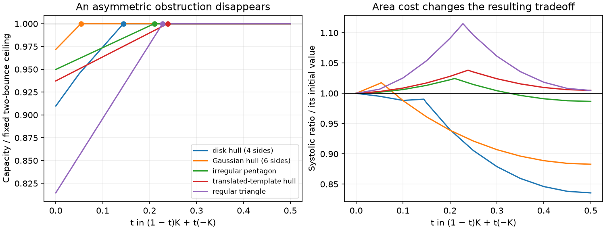

# First research window: shape information and symmetrization

2026-09-18. Owner `pentagon_partner_research`. A heterogeneous collection led to
an elementary proof for **every centrally symmetric partner**, and to a concrete
explanation of why our first fixed-width paths could not reveal new capacity
behavior. The discovery-method owner separately used the collection to expose a
missing near-circular asymmetry regime. These are different outcomes; neither
should be reduced to a systolic maximum search.

## Mathematical outcome

The [proof and independent-check status](symmetric-partner-lemma.md) establish,
for fixed regular Q=P5 and any centrally symmetric planar convex K,

```
c(K×Q) = max{r : r(Q-Q)^polar ⊆ K-K} = A2(K,Q).
```

The symmetric partners have sharp maximal systolic ratio
(10+6sqrt(5))/25≈0.936656, attained precisely by translates/dilates of the
regular decagon B=(Q-Q)^polar/2. The proof is a short explicit containment of
all ten normal triangles in B, followed by monotonicity and an area comparison.
It does not depend on the independent-affine-pentagon theorem, a finite sampled
classification, or the numerical optimization of shapes. An independent agent
checked the argument. Human acceptance and literature novelty remain open.

For every K, whether symmetric or not, A2 equals the capacity of its central
symmetrization (K-K)/2 times Q. This gives a geometric interpretation of the
ratio c/A2. A corollary says that a sys>1 partner must have difference-body area
excess area(K-K)/(4area(K))-1 > 0.0676274578121. This necessary condition is not
sufficient, and no sharpness or novelty is claimed for this corollary.

## What ran, and what it actually sampled

[Collection](collection-v1.jsonl): 33 base geometries and 16 grouped descendants,
computed in 1.473 seconds. The bases comprise disk/Gaussian point-cloud hulls,
irregular half-plane intersections, zonotopes, smooth-support approximants,
independently translated-template hulls, and exact-family controls. Actual side
counts span 3–90. Raw points/half-planes or construction parameters and all final
vertices are retained. This is designed coverage, not IID sampling of polygons.
Cloud point-count levels were coupled to anisotropic stretches; do not interpret
a side-count association as a population law.

The retained measurements are full fitting vectors and dual/contact data;
directional support/width fields; exact-polynomial uniform-area covariance and
third/fourth moments; centroid-polar area; difference-body area; perimeter; and
capacity/area/A2 separately. Moment calculations use signed-triangle monomial
integration, not vertex averaging or Monte Carlo. Degree-three skew is not a
complete asymmetry measure: the regular pentagon has zero third moments while
being asymmetric. The centroid-polar product uses the area centroid, not a
computed Santaló center. Facet-weight responses and fields remain tied to the
chosen factor coordinates; they are not additional intrinsic capacities.

The first four fixed-width paths all started with c=A2. Their capacity must
therefore remain constant: A2 stays fixed, and concavity puts capacity above its
equal values at opposite endpoints. Their changing systolic ratios were just
area changes. This was an uninformative initial selection, correctly retired as
a discovery claim rather than enlarged.

We then selected five bases with strict c<A2 and computed fixed-width paths,
plus adverse symmetric controls. [Follow-up](symmetrization-v1.jsonl) contains
94 measurements, including repeated endpoints and threshold checks; these are
not 94 independent shapes. This took 2.112 seconds. Combined files contain 143
records, with only 33 originally sampled bases.

## Interpreted path contrasts

All five selected strict-gap paths reached the two-bounce ceiling before the
symmetric midpoint. The onset was computed by a separate three-variable LP for
each template, then checked immediately below, at, and above the resulting
threshold. It was not guessed from a coarse grid.

| Base | Initial c/A2 | First t with c(K_t)=A2 | Initial area excess delta |
|---|---:|---:|---:|
| Disk-cloud hull, 4 sides | 0.909748 | 0.144123 | 0.44606 |
| Gaussian-cloud hull, 6 sides | 0.971836 | 0.053713 | 0.19929 |
| Irregular half-plane pentagon | 0.949845 | 0.209982 | 0.12339 |
| Translated-template hull | 0.937280 | 0.238438 | 0.13280 |
| Regular triangle | 0.814576 | 0.227633 | 0.50000 |

Neither the initial capacity deficit nor this scalar area-asymmetry measure
orders the observed onset. For example, the disk hull has a larger capacity
deficit and much greater delta than the template hull, yet loses the obstruction
earlier. This is an observed contrast on specified paths, not a universal
classification or proof that all scalar summaries fail.



Lines join measured values, including the LP-derived onset checks; dots mark
those onsets. The right panel illustrates why a monotone capacity increase need
not improve the normalized ratio throughout a path. The four-sided disk hull
loses ratio immediately; the other four initially gain it. Those changes are
interpretable using the exact mixed-area identity

```
area(K_t)=area(K)+t(1-t)[area(K-K)-4area(K)].
```

The geometric unresolved question is what controls saturation onset beyond a
single asymmetry magnitude. Capacity is piecewise linear along these polygonal
paths because the union normal fan is fixed and its support offsets vary
linearly. If this question earns further effort, retain the finite fitting
constraints and their dual changes rather than fit a smooth scalar regression.
No universal upper bound on onset below 1/2 has been proposed from five paths.

### Onset LP

Let A_i be unit normals of K-K, h_i^+=h_K(A_i), h_i^-=h_K(-A_i), and
s_ij=h_Tj(A_i). These normals describe K_t for 0<t<1 and also describe its
limits at the endpoints, with redundant inequalities allowed. With a=A2(K,Q),
find the smallest t in [0,1/2] such that some translation u satisfies

```
A_i·u + a s_ij <= h_i^+ + t(h_i^- - h_i^+), every i.
```

The maximum of these ten minimal parameters is the onset. Each feasible
parameter set is an interval containing 1/2, so their intersection starts at
that maximum. The separate symmetric-partner argument establishes feasibility
at 1/2; the LP derivation does not presuppose an empirical threshold law.

## Cross-line finding and changed acquisition judgment

The discovery-method owner inspected the actual collection independently. It
reported that all 49 initial rows satisfy the tempting affine-moment inequality

```
beta4 >= 16/3 + (2/3) skew_tensor_norm_squared.
```

It then analytically falsified that candidate on strictly convex near-circle
radial shapes r(theta)=1+a cos(3theta), for small positive a. This source family
was absent from our collection: our smooth-support approximants included a
sizeable degree-two mode alongside degrees three and five. The proof and adverse
acquisition belong to `../relation-discovery/`; this paragraph records the
cross-line report, not a duplicate independent audit. No capacity measurements
were needed to discover that limitation.

This is a concrete reason to add controlled pure-harmonic shape families in the
next acquisition. It is a stronger next step than merely generating more random
polygons or optimizing sys. The degree-three zero of regular pentagons likewise
shows why several independent directional/asymmetry descriptions are useful.

## Judgment and next bounded work

The main revision is mathematical: symmetric partners now have a complete
capacity/optimal-ratio description under the checked argument. More examples
from that class serve as controls, not as evidence for an unknown capacity law.
The broad line remains open for asymmetric partners and target-free geometry.

Recommended continuation: use the methods owner's explicit adverse family to
extend shape coverage, adding degree-three versus degree-five perturbations with
comparable ordinary geometry. Develop only the measurements needed to distinguish
those examples, and examine the relation before automatically adding capacities.
An estimated 30–60 minute next session should expose which representation really
separates the regimes and whether there is a useful corrected moment statement;
coordinate with that owner rather than duplicate its proof. In parallel, root
can judge the symmetric lemma's mathematical relevance and request a narrow
novelty check. Neither action needs another large random sample.

The saturation-onset question is retained as a concrete optional branch. It
should receive further work if the resulting contact geometry suggests a simple
constraint or separating family; five fitted onset numbers do not justify an
optimization campaign. A planned arbitrary-partner extremal proof was not an
input to, or a dependency of, the symmetric theorem we actually obtained.

## Reproduction and validation

Run, from checkout root:

```
uv run --with numpy==2.5.3 --with scipy==1.18.1 python docs/empirical-viterbo-design/desk/pentagon-arbitrary-partner/collection.py
uv run --with numpy==2.5.3 --with scipy==1.18.1 python docs/empirical-viterbo-design/desk/pentagon-arbitrary-partner/symmetrization.py
uv run --with numpy==2.5.3 --with scipy==1.18.1 python docs/empirical-viterbo-design/desk/pentagon-arbitrary-partner/validate_collection.py
uv run --with matplotlib python docs/empirical-viterbo-design/desk/pentagon-arbitrary-partner/plot_paths.py
```

[Metadata](collection-v1-metadata.json) retains seed, coordinate convention,
directional grid, version and input/script hashes. The
[follow-up summary](symmetrization-v1-summary.json) retains onset LP witnesses
and source hashes. [Validation](validation-v1.json) passes independent
rectangle/triangle A2 fixtures, monomial/affine transformation checks, fixed-width
and mixed-area identities, and primal/dual residual checks. Largest retained LP
residual is 3.14e-14. These numerical checks are not rigorous certificates.
The original evaluator's 15-body analytic calibration remains separate.

No historical table rebuild, general 4D capacity producer, host-state changes or
secret access occurred. Root owns the coherent commit. Code and datasets are
scoped to this directory; cross-line analysis remains with its owner.
