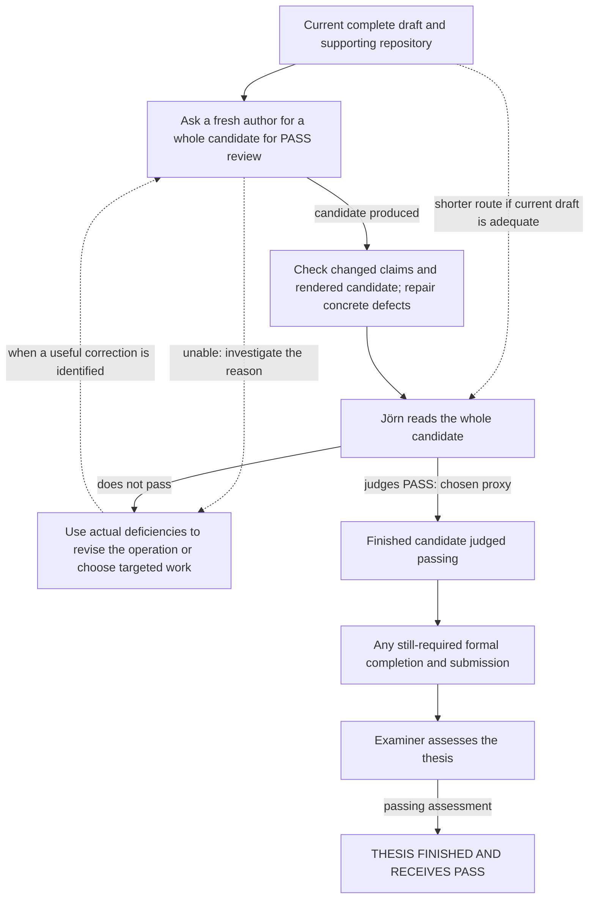

# Historical work map — archived September 16, 2026

This file preserves first-sprint chronology, including claims and pending-task
states later superseded. It is not an active task queue. See
`../todos.md` for current state and artifact routing.

Updated 2026-09-14. Non-authoritative planning view; the reasons and user
decisions behind it live in [planning context](planning-context.md).
[Outcome coverage](outcome-coverage.md) retains whole-thesis composition, long
proofs, eventual delivery and new discovery findings beyond the proposed session
portfolio. It is not an exhaustive graph or additional assignment queue.

## September 14 root coordination

September 15: Jörn judges the frozen whole thesis FAIL, but substantially closer
than prior Sol candidates. He withholds a roughly one-hour Astra Pro review and
explicitly requests a ten-minute self-review first, to compare incremental
findings. The context-informed pre-Pro review is recorded in
`.git/codex/review-calibration/self-review-2026-09-15-pre-pro.md`; preserve it
unchanged after the Pro review arrives. The frozen thesis remains unchanged.
Pro review received in `thesis_review_bundle.zip`; comparison is recorded in
`.git/codex/review-calibration/pro-comparison-2026-09-15.md`. It adds a checked
analytic pentagon-profile proof and an exact restricted ridge–capacity law,
plus missing relevant literature. IMPORTANT: the earlier coordinator claim
that EHZ/cylindrical coincidence remains open in R4 is WRONG; Jörn's recollection
was correct. Abbondandolo–Edtmair–Kang arXiv:2412.01777 Corollary 1 covers all
convex bodies in R4. Frozen manuscript/old review records retain the erroneous
historical wording; do not treat it as current mathematical truth. Pro's
independent exact HKO reconstruction was inspected and rerun successfully.
Next: jointly prioritize revisions and a second deadline. No thesis changes,
new experimental campaign, second deadline or whole-thesis PASS are authorized
or established by the comparison itself.

Latest user clarification at the 18:00 checkpoint: the original session grade
still depends on a whole-thesis PASS/FAIL signal by 18:00; no whole-thesis PASS
was obtained. A separate second deadline may be discussed after his review,
using process learnings without retroactively changing the original criterion.
The unchanged 17:57:48 build was copied/served just after 18:00 as
`.git/codex/thesis-review-1800/main.pdf` (86 pages; URL/hash in its README).
Do not call the goal complete merely for freezing. Remaining human review gates are
rotated pentagons, data science, revised introduction, and conclusion. He is
optimistic about pentagons but explicitly uncertain whether DS is PASS or FAIL.

17:55 Berlin update: Jörn explicitly finished Chapter 4 and judges it
appropriate/PASSing, with borderline writing quality. HKO also has an earlier
explicit chapter PASS. Whole-thesis PASS remains open; an async overall
judgment/remaining-concern question is pending. Latest fixed candidate is
`.git/codex/thesis-review-1755/main.pdf`, 86 pages, including later prose and
AI-account corrections; current browser review still serves the 17:30 PDF.
Do not switch the server merely because the newer snapshot exists.

17:52 Berlin update: Jörn is skipping among chapters to prioritize substantive
content and corrected Section 13.1's account of AI contribution. His input was
the conjecture plus an incomplete upper-bound/modulo-symmetry strategy, not a
specified finite derivative certificate. A GPT-5-series model developed
essentially the full proof and SageMath code, including the 26-bound and
invertible-5x5-minor route after only 25 nonsingular cases in the first approach.
Exact model version is uncertain. Candidate AI source now reflects this direct
testimony; `.git/codex/ai-writing/source-map.md` owns attribution limits.
A read-only host-side Luna session-search prompt was given, with June 4 repo
commits as a date lead; no host result received. The working candidate also has
subsequent Section 2/4/5/6 prose repairs; the fixed 17:30 review PDF is unchanged.

17:40 Berlin update: Jörn rejected the opening prose of the new PDF's
preliminaries and “without further comment”, questioned automated review
readiness, and skipped to Chapter 4 to probe mathematician-vs-CS exposition.
Coordinator withdrew the implied prose-readiness claim, changed the active
review prompt from math-prerequisite screening to sequential prose review, and
applied further candidate-only fixes. The fixed 17:30 PDF and server remain
unchanged. The current working PDF has subsequent Section 2/4 changes.
At 17:39 the coordinator explicitly told Jörn that approval by 18:00 is no
longer realistic at the observed correction rate, with no reliable replacement
time yet. Goal remains whole-thesis PASS, not chapter checks or build success.

17:33 Berlin update: DS lane explicitly transferred all source/evidence and
follow-up responsibility to this coordinator; no branch merge is involved.
Owner boundaries are in `.git/codex/ds-first-wave/writing/ownership-fold-request.md`.
The fresh fixed 86-page `.git/codex/thesis-review-1730/main.pdf` is now the
active human review after Jörn finished the old introduction and agreed to
switch. URL is in its README; do not replace this review server during reading.
It includes literature context and revised reading guide, abstract/intro
feedback, HKO named lemmas/figures/complete annotated CAS program. No
whole-thesis PASS exists. Earlier fixed PDFs are preserved in the same bundle.

Current update, 17:15 Berlin: Jörn finished the fixed seven-page HKO draft and
judged it already PASSing. He is now reading the fixed 81-page whole-thesis PDF
at `.git/codex/thesis-review-1700/build/main.pdf`; preserve that PDF and its
active review server. No whole-thesis PASS exists. Abstract feedback is applied
only to the evolving `.git/codex/thesis-candidate/` sources and recorded in
`.git/codex/review-calibration/whole-thesis-reading-1700.md`. HKO named lemmas
and figures are integrated; final proof/figure pages were checked visually.
The annotated CAS appendix is now integrated as complete actual source listings,
with lemma-linked commentary and all exact assignments. Its executable core
passed an exact run and independent source/formula comparison; its rendered
pages were checked. The rejected pseudocode version was replaced. Original tracked
thesis sources remain untouched. The dated paragraphs below are earlier state.

Current artifact update, 16:20 Berlin: whole-document scratch candidate is
`.git/codex/thesis-candidate/build/main.pdf` (81 pages; build has no undefined
references or overfull boxes). It includes the revised variation section and
the repaired appendix heading. Original thesis sources are untouched; their
PDF was rebuilt following the auxiliary-directory mishap documented in the
candidate README. No whole-thesis PASS exists. A full layout audit covered the
preceding 83-page snapshot; the changed appendix page was then checked directly.
HKO's fixed seven-page PDF awaits human reading feedback. The review-server
404s logged truncated URL paths, while the complete HKO path serves locally;
the existing server and links were retained.

The revised DS opening received further human objections: confusing first
sentence and unnecessary example lists, specifically the ordering/prediction/
features list; tense was queried, not prescribed. The DS agent owns a separate
revision, preserving the currently served PDF. The earlier sample's passing
prose-comfort judgment does not approve this opening or the whole chapter.
The older pending-sample statements below describe earlier coordination state.

At 16:32 Berlin the candidate is 81 pages after replacing the stale empirical
appendix inventory with the substantive optimizer supplement and adding a
worked fixed-word cube example. Latest hash and check scope are in its README.
Jörn liked the new DS first sentence, then requested joining the quantities
clarification by a comma; that change is integrated. He reported no pending
async reading task, so the HKO request was explicitly resubmitted and accepted.
The server subsequently logged a successful HKO PDF GET at 16:29:39 Berlin.
That proves delivery, not completed reading or approval.

At 15:46 Berlin, coordination transferred to thread
`01a0a021-b283-7fa3-9e16-aec87ce950df` (Herdr `w2:p1`). Jörn's current
target is his PASS approval today at 18:00 Berlin; he can make about 2h15
available for reading and requests early notice if changing plans is needed.
The coordinator has reported a concrete deadline risk, not a delivery promise.
The datascience agent (`w1:p3`, thread `01a09fd9-2ffe-7681-850d-139298baf0c3`)
retains DS evidence and chapter drafting; the new coordinator owns manuscript
coordination, HKO writing, review workflow, and shared memory/graph. Existing
scratch inputs are in `.git/codex/`, not a worktree-root `codex/` directory.

Jörn clarified in this conversation that he has not read, or does not recall
enough of, the September 14 assessment to endorse its completeness or accuracy.
Preserve its specifically attributed earlier feedback without interpreting the
assessment as blanket user approval. He points to `most-circular-square`
session history for his report/PDF review procedure; a focused host-side
retrieval prompt has been supplied because that project and host inventory
are not accessible here. No independent human-review dataset was found in the
inspected project artifacts. The fixed DS sample is awaiting feedback; its
agent layout review is being recorded before that feedback arrives.

The current root has resumed coordination toward a thesis PDF Jörn judges PASS.
The reviewed [thesis diagnosis](../docs/thesis-assessment-2026-09-14.md) and
[data-science review](../experiments/sys-datascience/coordination/datascience-review-2026-09-14.md)
supersede the September 11 uncertainty about whether the current prose is an
adequate writing base. Retain the research and agreed TOC; compose fresh Astra
prose, complete the HKO exposition, recover empirical definitions, and develop
the substantive AI-reflection direction in the assessment. A fixed two-page fresh prose sample is awaiting Jörn’s reading feedback; the
complete manuscript rewrite remains unfinished.

Three internal workers completed the first DS readiness probe, opportunity
audit, and core claim/source/evaluator ledger plus chapter skeleton. The fresh
producer/consumer path runs; a tiny arbitrary-body adapter has passed initial
controls and independent review. The failed initial generic cache computation
erased its underlying error; it is procedural evidence, not a scientific
negative. The ledger recovers prospective sub-threshold enrichment and its
limits. Existing evidence does not settle when exploration should stop.

Current runtime reports and rendered graph are under the Git common directory:
`codex/ds-first-wave/` and `codex/task-graph/`. The graph owns live assignments.
Jörn challenged the proposed wave's long ceilings as lacking resource estimates.
Code inspection supports a small paired-height experiment: one edit batch, one
command batch and a write-up, with a working estimate around five minutes total.
Jörn approved proceeding and clarified that these small tasks need no repeated
permission: briefly assess, execute, and escalate actual conflicting constraints.
Paired-height and orientation pilots completed and passed independent review;
see [wave results](../experiments/sys-datascience/coordination/exploration-wave-2026-09-14.md).
CEM v1 stopped on an unsupported primal norm; its source/results are preserved.
A separately frozen v2 completed all 1,344 actual evaluations in 215.797 seconds
and passed independent review. CEM beat IID in all three pairs on maximum and
best-eight median, with lower measured process costs. No ratio exceeded one.
HKO writing inputs and independent review are complete at
`codex/hko-writing-input/` in the Git common directory: base geometry, the full
40-coordinate volume derivative, a worked feasible section and all 26 exact
section choices. Its four-page input preview has been built and visually checked.
Full rank/positive-kernel claims retain existing theorem-packet status; this was
not a full certificate rerun. A fresh explanatory opening is built at `codex/hko-writing/opening-preview.pdf`
and has passed a bounded mathematical review. Concrete calculations and the
Hausdorff-to-chart reduction still need to enter the completed chapter. A fresh two-page prose
sample is built at `codex/ds-first-wave/writing/sample.pdf` in the Git common
directory; an async question requests Jörn's reading-experience feedback.
The adapter review and existing optimizer reporting addendum are complete.

The host coordinator relayed Jörn's clarification that workers use internal
subagents. Further top-level Herdr prompts require prior approval of their
actual text. Merges remain subject to explicit approval; the rejected combined
integration is not approved. Jörn directly corrected the root on September 14:
ending its turn prevented subagent-completion notifications and required his
manual restart. Keep the coordination turn active through returns and review;
use async user questions while independent work continues. The global
`agent-coordination.md` records this observed client behavior.

The paragraphs below retain dated September 11 context. Their withdrawn launch
proposals and authoring recommendations are historical, not current assignments.

## September 11 PM session

Jörn requests continuous delegation-led project management. Completion proxy:
explicit approval from him after reading the thesis PDF that he thinks it earns
a PASS. The PM coordinates and owns small integration writes; bounded exploration
belongs to subagents. Herdr top-level launches require his approval of the actual
prompt, because he must understand and converse with those agents. Consequential
questions/results use async questions or self-contained finals, not commentary.

Current assignment: provide Jörn a provisional project task graph with the
reasons for proposed routes, rather than assert an exhaustive decomposition or
an unsupported fastest route. The communication failures remain relevant to how
this work is checked; producing this map does not certify their durable repair.
Both launch requests were withdrawn. The remaining crate inbox item was removed
using the TUI skip action without answering, and absence was checked live; the
route is in global memory `agent-coordination.md`. No launch or next-work
priority is approved.

The PDF was refreshed after the September 7 prose changes and September 11
evidence qualifications. `./thesis/check-build.sh` passed its selected PDF,
overfull-box and reference checks; rendered page 104 was also inspected.
Full-manuscript visual/scientific review remains open. Pre-existing `tmp/` is
untouched.

Jörn clarified that roughly 99% of the proposed experiment's value is learning
whether a repeatable low-cost operation produces useful thesis content; retaining
the particular revised chapter is incidental and its worktree can be discarded.
No authoring experiment or launch prompt is currently agreed. The PM withdraws
both its HKO-first and subsequent whole-thesis-attempt recommendations: it has
not justified their expected learning relative to cost. No Herdr launch is
authorized. Historical session proposals are not current launch instructions.

Authoring remains open. A single-crate quality calibration is also a current
user proposal: `algebraic-numbers` is a bounded candidate, not a demonstrated
bottleneck. Its [pilot prompt](/tmp/msc-math-prompts.JXv7AM/crate-quality-session-prompt.md) is prepared
as an unapproved draft. The PM withdrew the crate-first recommendation pending
the unresolved communication and priority discussion. Read-only assessment found repeated
solver elimination, incomplete generated nullspace checks, documentation drift,
and an endpoint-rounding conversion panic inferred from source and an independent
binary64 calculation (not a Rust regression); these are scoped candidates,
not an instruction to implement all of them. Broad refactoring and shared-skill
revisions have not been established
as prerequisites for passing.

Jörn reports that even realistic timelines have led agents to declare defeat
and attempt desperate actions, with claimed three-day work taking ten minutes.
This is his observed planning failure, not measured general model performance.
No new deadline was supplied. Sequence bounded work by its contribution and
observed cost; unsupported duration estimates do not justify defeat or shortcuts.
The remaining launch draft is temporary material under `/tmp`, not project
documentation; its path may expire after the launch decision.

## Provisional routes to a finished passing thesis

Project goal: finish the thesis with a passing grade. The user-selected operational
proxy is Jörn explicitly judging PASS after reading the PDF; this is evidence for
the goal, not a logical guarantee of the university's grade. No route or launch
is selected. The map must include a complete success story and compare proposed
steps with their omission, not merely list things that might help.

### Direct manuscript route as a comparator

This is a possible successful route, not a claim of fastest sequencing or an
exhaustive decomposition. The arrows describe what happens in this story if the
operations work. A complete 110-page draft and supporting repository exist.

The last steps are conditional on actual current requirements and status, which
have not been established; this does not reactivate old administrative tasks.
Jörn's final reading is a future decision, not assigned by drawing the arrow.

The story could work if remaining defects are identifiable and repairable using
the current material, the author/checkers can make those repairs without larger
regressions, and the finished work meets the actual assessment requirements.
The complete draft and successful bounded evidence repairs support feasibility;
they do not establish those authoring abilities, current manuscript adequacy,
convergence under feedback, or total cost. An unexplained failure does not justify
indefinitely repeating the same operation. It may call for a targeted diagnostic,
a different authoring approach, or direct human contribution instead.

### Omission comparisons

The comparison concerns impact on success and total effort, not whether both
versions have some imaginable successful outcome. These judgments apply to this
comparator route, not all possible routes.

| Proposed insertion | Downstream consumer / intended causal effect | What changes when omitted? |
| --- | --- | --- |
| Fresh authoring attempt | Full reading receives a candidate with defects repaired before Jörn spends his attention. Its observed behavior informs whether to reuse/change that operation. | Jörn could read the existing PDF instead. We have not established whether authoring saves more reading/repair effort than it costs or introduces. This is an unresolved comparison, not an automatic authoring-first priority. |
| Candidate checking | Repairs found build/rendering problems and consequential changed-claim errors before full reading. | Saves checking effort but can pass introduced defects to Jörn. Build checks and specific record-to-claim checks have concrete local evidence; broad agent review as a predictor of Jörn's judgment remains unvalidated. Scope checks to what they can actually detect. |
| HKO-only method experiment | Could supply a cheap operation for a needed HKO repair, or diagnose a failure affecting the larger operation. | The whole-candidate operation remains executable without it. No current HKO bottleneck or specific diagnostic saving establishes its place in this route. That does not imply HKO learning has no value in another supported route. |
| Single-crate quality calibration / subsequent migration | Could improve future code comprehension, evidence/figure implementation, or scientific checking, reducing manuscript-work cost and errors. | We already recovered support and made bounded wording repairs without it. Concrete code issues exist, but no effect large enough to favor inserting calibration here has been established. Count scientific regression checks and Jörn's calibration effort as costs too. Expected broad savings could justify it; an observed blockage is not the only possible justification. |
| Broad prompt/skill redesign | Could reduce failures in later work selection, authoring and feedback incorporation. | A direct authoring route remains plausible. No particular skill has been shown to cause the observed failures, and previous instruction edits did not stop recurrence. Broad redesign needs a benefit argument beyond those failures existing. |
| Narrow communication/coordination repair | Can prevent observed wrong task selection, changed user meaning, and inaccurate action-status reports from wasting later work. | This session supplies actual examples of the waste. An effective intervention or bypass could reduce it; effectiveness of the current temporary response check is not established by one reviewed reply. |
| Full reading by Jörn | Supplies the explicitly chosen PASS proxy and potentially identifies remaining deficiencies. | The selected proxy remains unobserved. Neither generated text nor agent consensus replaces it. |
| Any still-required formal completion | Makes an acceptable manuscript a formally completed thesis receiving an actual grade. | A private acceptable PDF might meet the operational proxy without completing the project externally. Whether any particular formal step remains is presently unknown. |

Candidate operations may produce reusable learning as well as a draft. For the
proposed authoring experiments, Jörn identifies the former as roughly 99% of the
value. Preserve the actual operation/context and consequential interventions when
that learning is the point. Local observations do not automatically establish
cross-chapter transfer. A candidate that already achieves the goal does not need
additional method-generalization research merely to satisfy this map.

Evidence owners for the comparisons:

- [Data evidence](datascience-scope.md): retained-record checks enabled two precise
  qualifications without rerunning producers. Historical frozen-table numerical
  guarantees remain unresolved; qualification or other scientific choices may
  suffice depending on the retained claim.
- [Authoring comparison](authoring-workflow.md): a local correction and conflicting
  exposition judgments, not evidence of human-acceptable repeatable authorship.
- [Architecture evidence](architecture-migration.md): concrete opportunities and
  scientific-contract differences, not measured savings for remaining thesis work.
- [Broader discovery](outcome-coverage.md): whole-thesis composition, long proofs,
  interpretation, source/figure maintenance and publication questions. These can
  change the route when they matter to actual remaining work.

The inspected evidence does not rank the comparator and its insertions by expected
total effort to PASS. Its decisive unresolved comparison is whether authoring and
checking save more human reading/repair effort than they consume or introduce.
That uncertainty is exposed here, not resolved by drawing a complete story.

Conditional dependencies that can actually guide work:

- A claim of preserved scientific behavior needs checks of the behavior affected
  by that change; for example complete nullspaces, arithmetic, or historical
  evaluator interpretation. This does not imply a comprehensive audit before
  every edit.
- If a specific authoring attempt is obstructed by missing evidence, an absent
  figure capability or a code defect, that obstruction can justify enabling work.
  No such observation currently justifies a global code-cleanup prerequisite.
- Local observations inform the tested operation and setting. A broader
  repeatability or transfer claim needs an argument appropriate to that claim;
  a local experiment need not establish broad transfer to have local value.

Discovery remains open: additional deficiencies, useful operations or constraints
can change this map. Revisit its edges when an attempt supplies new information;
do not treat these headings as the complete space of possible work.

## Sprint disposition and next ownership

On 2026-09-07 Jörn authorized a roughly 15-minute parallel repo-improvement
sprint, with isolated worktrees and one integration worktree. Integrated results
are reflected above. The main agent owns follow-on selection; the completed
subagent tasks do not assign anyone the remaining thesis work. No research run
or comprehensive audit is queued.

The unlimited-budget sprint is finished; normal-budget work has resumed.
All implementation commits were integrated. Branches `migration/20260907-*`
retain the worker histories after removal of their clean scratch checkouts.
The unmerged process-handoff packet is superseded by global memory, not pending
integration. The changed TeX was subsequently rebuilt on September 11; full visual review
remains open.

The migration purpose is predictable tools, useful navigation and enough
accurate context for fresh agents to avoid costly wrong work. It does not
certify the thesis or settle every research question.

## Completed work: evidence owners

- [Migration review](../docs/migration-review.md): assignment-clarity repair,
  obsolete-guidance removal, scratch preservation/removal and recovery pointers.
- [INSTALL](../INSTALL.md) and [environment evidence](../docs/development-environments.md):
  named environment/Sage checks and their limits; not comprehensive reproduction.
- [HKO author context](hko-author-context.md) and
  [optimizer review route](optimizer-review-route.md): bounded memory pilots.
  [Planning context](planning-context.md#bounded-checks) records what their
  retrieval check did and did not establish.
- [Gradient method](../experiments/dev-gradient-ascent/METHOD-CANDIDATE.md) and
  [package README](../experiments/dev-gradient-ascent/README.md#directory-map):
  algorithm and recovery/support limits after charter/promotion-packet removal.
- [P2 packet](../experiments/sys-datascience/methods/standard-baseline-p2/README.md):
  completed input reconstruction with matching hashes, including unauthorized
  CPU-load incident and resource warning. No rerun queued.
- Global installation/distribution remains DevOps-owned. Jörn separately
  authorized this sprint's live shared-skill edits: memory/skill-design writing
  guidance was refined, not reorganized into a new framework. The remaining
  cross-skill design question lives in global memory
  `~/.agents/memories/process-knowledge-design.md`.

## Not assigned by this map

Broad proof audit, archive publication and administrative verification are not
current migration assignments. A local-maxima-screen rerun is not queued; the
missing historical producer state is already disclosed in the thesis.
Current deadline/submission status remains unestablished here; old pending
administrative notes are not current tasks. See
[project facts](../docs/project-facts.md) for dated scope and submission context.
