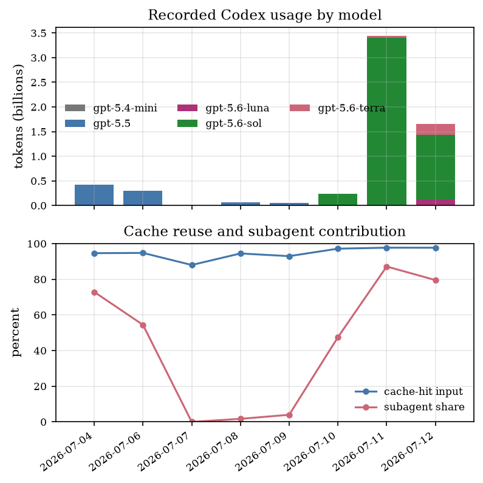

# Codex token-usage analysis

Status: diagnostic report, snapshot at 2026-07-12 19:39 UTC. This report is
about local Codex interaction cost and workflow control. It is not thesis
evidence for mathematical correctness, research impact, or authorship.

## Question

Why was token consumption unusually high on the last two days, and what
change would reduce it without removing useful mathematical review or
parallel exploration?

## Source and reproduction

Raw rollout JSONL under `/home/vscode/.codex` is the source evidence. The
producer is
[`scripts/analyze_token_usage.py`](../scripts/analyze_token_usage.py).

The snapshot was regenerated with:

```bash
uv run --script experiments/ai-use/scripts/analyze_token_usage.py \
  --start 2026-07-04 --end 2026-07-12 \
  --cutoff 2026-07-12T19:39:00Z \
  --exclude-thread-id 019f57d7-2e11-7181-aaab-685f65245ca8 \
  --root /home/vscode/.codex/sessions/2026/07 \
  --root /home/vscode/.codex/archived_sessions \
  --out-dir /tmp/codex-token-usage --plot
```

The current diagnostic thread is excluded so that investigating the usage does
not inflate the usage being investigated. The producer groups by the UTC
timestamp of each `token_count` event, uses `last_token_usage`, and skips
repeated records whose cumulative `total_token_usage` is unchanged. The
resulting CSV and JSON files are generated artifacts; the report records their
interpretation rather than copying their rows by hand.

## Main result

The change is primarily a change in orchestration scale and context length.
It is not primarily a cache-hit collapse, and the logs do not support blaming
5.6 by itself.

| UTC date | Usage events | Rollouts | Total tokens | Input | Cached input | Uncached input | Output | Cache hit |
|---|---:|---:|---:|---:|---:|---:|---:|---:|
| 2026-07-04 | 3,908 | 104 | 425.9M | 423.9M | 401.2M | 22.6M | 2.1M | 94.66% |
| 2026-07-05 | 0 | 0 | 0 | 0 | 0 | 0 | 0 | — |
| 2026-07-06 | 2,468 | 48 | 302.0M | 300.9M | 285.2M | 15.6M | 1.1M | 94.80% |
| 2026-07-10 | 1,925 | 35 | 233.8M | 233.1M | 226.5M | 6.6M | 0.7M | 97.18% |
| 2026-07-11 | 23,380 | 165 | 3.444B | 3.436B | 3.358B | 77.7M | 8.1M | 97.74% |
| 2026-07-12 | 12,263 | 156 | 1.661B | 1.658B | 1.620B | 37.9M | 3.3M | 97.71% |

The exact July 5 comparison point is empty. The useful comparisons are July
11 versus July 4 (same weekday) and July 12 versus July 6 (nearest recorded
baseline). July 11 is 8.1 times July 4; July 12 is 5.5 times July 6. July 12
is also 7.1 times July 10, despite both periods being dominated by GPT-5.6
Sol. This is evidence against a model-version-only explanation.

## What changed

### 1. Subagent fan-out became the dominant consumer

| Date | Root/user rollouts | Subagent rollouts | Subagent token share |
|---|---:|---:|---:|
| July 4 | 115.4M | 310.5M | 72.9% |
| July 11 | 441.8M | 3.001B | 87.2% |
| July 12 | 339.3M | 1.322B | 79.6% |

On July 12, the subagent total is split across depths 1, 2, and 3. The
dominant extra work is therefore not one unusually verbose answer; it is many
long agent calls in a branching research workflow.

### 2. Reasoning effort shifted toward expensive modes

On July 4 (GPT-5.5), 91.5% of tokens were at medium effort and 8.5% at high.
On July 11, high effort accounted for about 68.6%, medium 19.9%, low 8.0%,
and xhigh 3.5%. On July 12, high was about 59.8%, low 24.2%, and medium
16.0%.

This does not show that high effort is intrinsically wasteful. It shows that
the recent workflow spent most of its volume in high-effort, parallel review
and research sessions.

### 3. Cache reuse improved, but absolute uncached input still grew

Cache-hit input rose from 94.66% on July 4 to 97.71% on July 12. Absolute
uncached input nevertheless rose from 22.6M to 37.9M because the total input
volume was much larger. On July 11 it reached 77.7M.

The main cache-related risks visible in the logs are:

- new subagent branches with distinct prefixes and inherited context;
- long sessions crossing compaction boundaries;
- model/effort/context changes inside long-running work;
- repeated large tool outputs across independent agents.

There is no evidence of a single file being read thousands of times. The
largest direct read counts in the two high-usage days were in the tens to low
hundreds. The repeated material is better understood as many agents carrying
similar research context, not as one pathological file loop.

The logs contain 148 compaction markers on July 11 and 24 on July 12, versus
14 on July 4. This is consistent with the long-context explanation, but the
logs do not expose a per-token cache-miss cause, so it remains an inference.

## Diagnostic figure



*Figure 1. Diagnostic snapshot generated by `analyze_token_usage.py`. The top
panel shows total recorded tokens by model; the bottom panel compares cache-hit
input with the share of tokens consumed by subagents. The figure is explanatory
workflow evidence, not a thesis result and not a controlled experiment.*

The figure's useful comparison is the simultaneous jump in total volume and
subagent share on July 11, while the cache-hit curve remains high. It should
not be read as a causal estimate of research productivity.

## API-equivalent shadow cost

The actual marginal subscription cost is zero under the current flat
subscription. The following is a counterfactual API-equivalent estimate, useful
only for comparing workflow choices.

As of 2026-07-12, the public standard text rates are:

| Model label | Input / 1M | Cached input / 1M | Output / 1M |
|---|---:|---:|---:|
| GPT-5.5 and GPT-5.6 Sol | $5.00 | $0.50 | $30.00 |
| GPT-5.6 Terra | $2.50 | $0.25 | $15.00 |
| GPT-5.6 Luna | $1.00 | $0.10 | $6.00 |
| GPT-5.4 mini | $0.75 | $0.075 | $4.50 |

Sources: [GPT-5.5 pricing](https://developers.openai.com/api/docs/models/gpt-5.5),
[GPT-5.6 Sol pricing](https://developers.openai.com/api/docs/models/gpt-5.6-sol),
[GPT-5.6 Terra pricing](https://developers.openai.com/api/docs/models/gpt-5.6-terra),
[GPT-5.6 Luna pricing](https://developers.openai.com/api/docs/models/gpt-5.6-luna),
and [GPT-5.4 mini pricing](https://developers.openai.com/api/docs/models/gpt-5.4-mini).

The baseline estimate applies the input rate to uncached input, the cached
input rate to cached input, and the output rate to output tokens. The
long-context estimate additionally applies the public multiplier to requests
whose recorded input exceeds 272K tokens: 2x input and 1.5x output for the
full request. Both estimates omit tool-call fees and any cache-write surcharge,
because the local logs do not identify which uncached tokens are cache writes.

| Date | Baseline estimate | With >272K multiplier | Long requests |
|---|---:|---:|---:|
| July 4 | $375.90 | $375.90 | 0 |
| July 6 | $252.46 | $252.46 | 0 |
| July 10 | $168.20 | $179.72 | 70 |
| July 11 | $2,287.90 | $2,572.16 | 1,708 |
| July 12 | $953.21 | $1,040.91 | 472 |

The shadow estimate increases by about 6.8x from July 4 to July 11 and by
about 4.1x from July 6 to July 12. It is not an invoice and should not be
presented as money actually spent. Its practical value is that it makes the
cost of high-volume branching and long contexts visible even under a flat
subscription.

## Compensation proposal

The highest-value intervention is a workload policy, not further cache tuning:

1. Default delegated exploration to depth 1 and a small parallel fan-out.
2. Use low or medium effort for scouting, extraction, and bounded file audits.
3. Reserve high effort, Sol, and deeper delegation for shortlisted questions
   where the expected thesis value justifies the context cost.
4. Require a compact synthesis packet before another branch is spawned; do not
   pass an entire growing parent transcript when a source list, question,
   evidence boundary, and current result suffice.
5. Add a daily warning when subagent share or >272K request count crosses a
   chosen threshold. The committed producer already supplies the needed rows.

This preserves parallelism where it buys independent mathematical criticism,
while putting a budget around exploratory branching and repeated context.

## Status and limits

The producer and this report are experiment-support artifacts. The figure is a
diagnostic candidate, not thesis-ready. No claim here establishes that AI
improved or harmed the thesis, and the raw token fields do not reveal the
quality or usefulness of the work performed.
