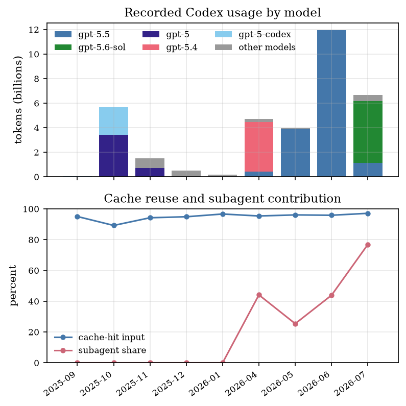

# Full-lifetime Codex token-usage analysis

Status: diagnostic report over all available Codex rollout archives as of
2026-07-12 20:34 UTC. This is a workflow and resource-use analysis, not
evidence for mathematical correctness, research impact, or authorship.

## Scope

The run covered native sessions, archived sessions, and the imported host-log
archive. There were 4,028 unique native/archived rollout filenames and 137
additional imported filenames; two imported copies overlapped native files and
were deduplicated. One current diagnostic thread was excluded.

The producer recorded 337,168 usable token-usage events after skipping 125,055
duplicate records with unchanged cumulative usage. The available logs contain
147 active dates from 2025-09-15 through 2026-07-12. This is the full visible
archive, not a claim that no work happened on dates with no local logs.

Reproduction:

```bash
uv run --script experiments/ai-use/scripts/analyze_token_usage.py \
  --start 2025-09-01 --end 2026-07-12 \
  --cutoff 2026-07-12T20:34:39Z \
  --exclude-thread-id 019f57d7-2e11-7181-aaab-685f65245ca8 \
  --root /home/vscode/.codex/sessions \
  --root /home/vscode/.codex/archived_sessions \
  --root /home/vscode/.codex/imported_session_logs \
  --out-dir /tmp/codex-token-usage-lifetime \
  --plot --plot-bucket month
```

## Lifetime totals

| Quantity | Recorded total |
|---|---:|
| Total tokens | 35.185B |
| Input tokens | 35.027B |
| Cached input | 33.254B |
| Uncached input | 1.772B |
| Output tokens | 157.6M |
| Cache-hit share of input | 94.94% |

The lifetime total is not monotone in time: the archive has substantial gaps in
February and March 2026, and activity is concentrated in bursts.

## Monthly view

| Month | Active days | Total tokens | Uncached input | Cache hit |
|---|---:|---:|---:|---:|
| 2025-09 | 6 | 37.8M | 1.8M | 95.07% |
| 2025-10 | 14 | 5.656B | 602.6M | 89.26% |
| 2025-11 | 19 | 1.499B | 85.4M | 94.25% |
| 2025-12 | 19 | 498.2M | 25.2M | 94.90% |
| 2026-01 | 6 | 194.8M | 6.4M | 96.69% |
| 2026-04 | 17 | 4.719B | 215.9M | 95.40% |
| 2026-05 | 25 | 3.958B | 153.9M | 96.10% |
| 2026-06 | 30 | 11.941B | 490.0M | 95.88% |
| 2026-07 through Jul 12 | 11 | 6.680B | 191.1M | 97.13% |



*Figure 1. Full visible archive aggregated by month. The five largest model
labels receive separate colors; smaller historical labels are grouped as
“other models”. The lower panel shows cache-hit input and subagent share. This
is a diagnostic workflow figure, not a thesis-ready result figure.*

The largest complete month is June 2026 at 11.941B tokens. July is not yet a
complete month, but its average over active days is about 607M tokens, compared
with about 398M per active day in June and 404M in October 2025. Thus the recent
problem is best described as unusually high daily intensity, not necessarily
the highest monthly total in the archive.

## Model transition

The archive shows a clear model/workflow chronology:

- October 2025 is dominated by `gpt-5` and `gpt-5-codex`.
- November 2025 through January 2026 contains GPT-5.1 and GPT-5.2 variants.
- April 2026 is dominated by `gpt-5.4`, with `gpt-5.5` beginning to appear.
- May and June 2026 are dominated by `gpt-5.5`.
- July 2026 is dominated by `gpt-5.6-sol`, with substantial Terra and Luna
  usage and a small residual 5.5/5.4-mini contribution.

This chronology prevents a clean intrinsic 5.5-versus-5.6 causal comparison:
the model transition coincides with a major change in agent orchestration and
parallelism.

## Subagent transition

Before April 2026, the visible logs have no subagent lineage records. From
April onward, subagents become material; in July they dominate:

| Month | Root/user share | Subagent share |
|---|---:|---:|
| 2026-04 | 55.9% | 44.1% |
| 2026-05 | 74.6% | 25.4% |
| 2026-06 | 56.1% | 43.9% |
| 2026-07 | 23.1% | 76.9% |

The July 11–12 burst is therefore part of a month-scale transition toward
subagent-heavy work, not an isolated model replacement. The two-day window
alone accounts for roughly 5.29B tokens and most of July's subagent share.

## What this changes operationally

The full archive strengthens the same compensation recommendation as the
recent-window report:

1. Treat parallel subagent fan-out as the primary budget variable.
2. Default exploratory branches to depth 1 and low/medium effort.
3. Reserve high effort, Sol, and deeper delegation for shortlisted questions.
4. Require compact synthesis packets before spawning another branch.
5. Monitor daily tokens, subagent share, and long-context request count.

Cache tuning remains worthwhile, but it is not the first intervention: the
lifetime cache-hit share is already 94.94%, and the recent high-use days are
characterized by more calls and more subagent context, not a collapse in cache
reuse.

## Shadow-cost boundary

The actual marginal subscription cost is zero. The producer's
`shadow-cost.csv` gives API-equivalent estimates only for currently mapped
public model labels, using the rates recorded in `summary.json`. Historical
labels such as `gpt-5-codex`, GPT-5.1, GPT-5.2, and GPT-5.3 Codex variants are
not silently assigned modern prices; therefore there is no honest single
API-equivalent dollar total for the entire lifetime archive without a
historical pricing map.

For the recent 2026-07 window, where the model labels are mapped, the earlier
report gives the useful comparison: approximately $2,572 API-equivalent on
July 11 and $1,041 on July 12 after the public >272K long-context multiplier,
excluding tool fees and unidentifiable cache-write surcharges. These are
opportunity-cost indicators, not invoices.

## Artifact status

The producer, this report, and the monthly diagnostic figure are committed as
experiment-support artifacts. The figure is not integrated into the thesis;
the AI-use chapter should use it only if a later reader/use decision finds that
the process-scale point belongs in the final narrative.
