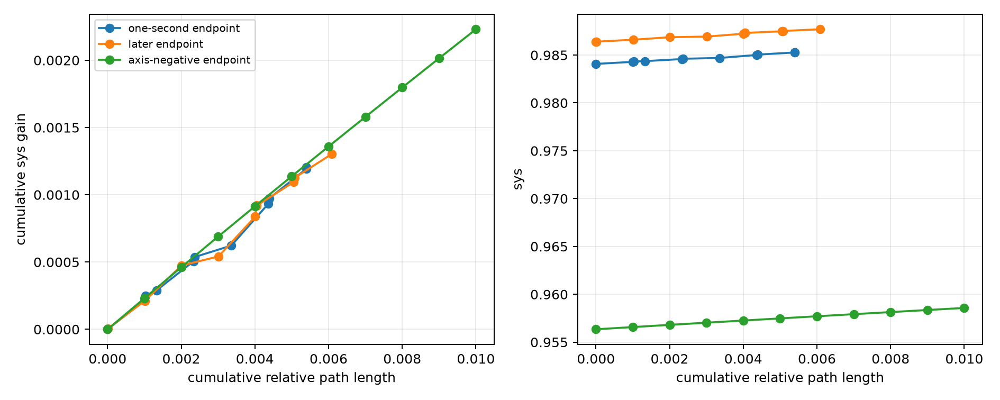
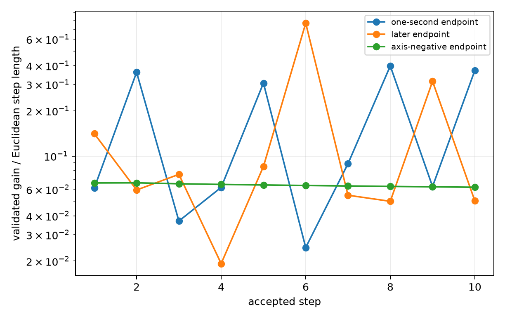
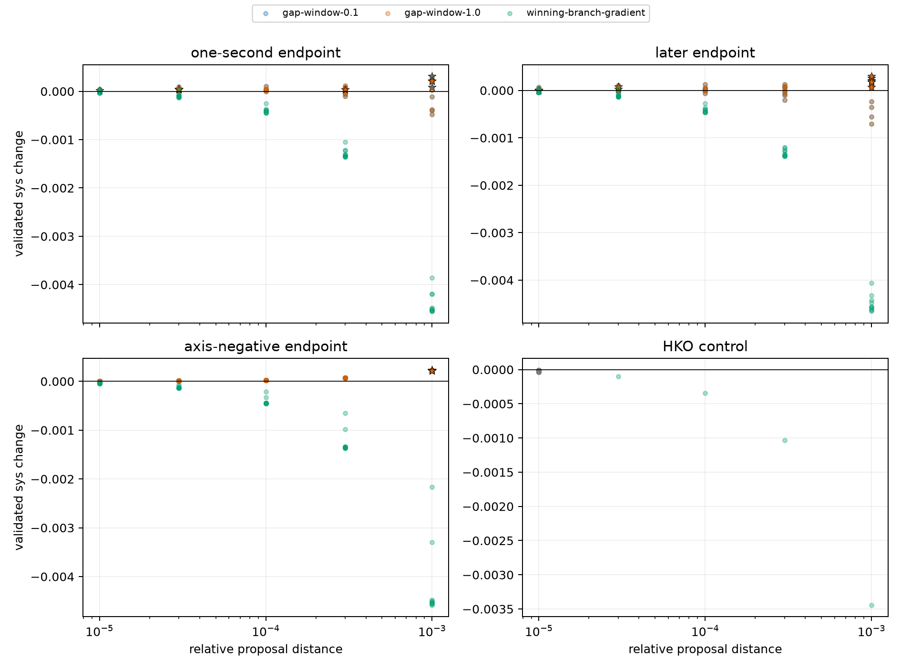
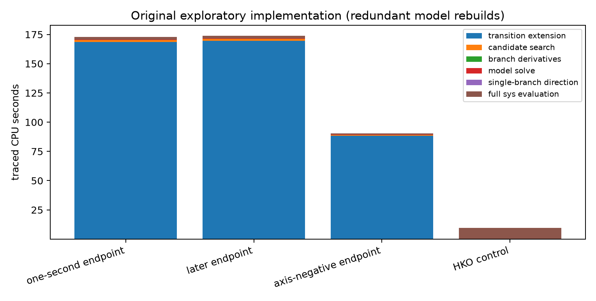

# Repeated ascent continuation: four-state exploratory result

## Answer

The two endpoints previously described as nearly converged are **not near a
local maximum in the tested finite-step direction family**.

The strongest counterexample is the endpoint whose 50 signed coordinate
directions were all negative. The finite-step multi-branch model took ten
successive relative-distance `1e-3` moves. Its validated slope changed only
from `0.0661837` to `0.0619829` while
`sys` rose by `0.00223027` over relative path
length `0.01`. Thus the
old axis poll missed a sustained oblique ascent path.

This run did **not** locate the eventual local maximum: all three generic paths
hit the ten-step diagnostic cap while still improving. It provides lower
bounds on remaining useful path and gain, not an estimate of the full distance
to a local maximum.

## Fixed controls and outcomes

- **one-second endpoint:** 10 accepted moves, relative path length `0.0054`, gain `0.00120435`, final tested slope `0.371273`; stop reason `accepted_step_cap`.
- **later endpoint:** 10 accepted moves, relative path length `0.00608`, gain `0.00130176`, final tested slope `0.0503176`; stop reason `accepted_step_cap`.
- **axis-negative endpoint:** 10 accepted moves, relative path length `0.01`, gain `0.00223027`, final tested slope `0.0619829`; stop reason `accepted_step_cap`.
- **HKO control:** no accepted move. Both finite-step models declined to emit a
  positive-prediction move. None of the five current-branch proposals or 50
  signed transverse coordinate directions at relative distance `1e-5`
  improved the fully recomputed scalar.

The positive and negative controls therefore behaved as required. HKO remains
a numerical control here; its theorem packet, not this run, establishes local
maximality.

## What the path shape says

For the axis-negative endpoint, consecutive directions differ by only
`0.03172` radians initially and
`0.01546` radians at step ten. The path
is becoming straighter, not oscillating among unrelated numerical directions.
Only two of its ten accepted moves change the fully recomputed minimizing
sigma.

A linear fit of slope against traveled relative distance would cross zero near
relative path length `0.132`, about `13.2` times
the observed path. That extrapolation is deliberately **not** used as a
convergence estimate: ten local points do not justify assuming the same
curvature or branch structure over that distance. Its useful implication is
only that the observed slope decay gives no evidence of imminent convergence.

The other two paths turn much more (`0.14`--`1.31` radians between successive
directions) and sometimes need `1e-5` or `3e-5` moves before a later `1e-3`
move becomes profitable. Their finite-step geometry is less regular, but their
final tested slopes remain positive.

## Why the earlier endpoint poll failed

The earlier poll tested the positive and negative directions of one
orthonormal coordinate basis in the 25-dimensional symmetry-transverse space.
A positive linear combination can improve a nonsmooth function even when
every individual coordinate direction decreases it. The multi-branch
max--min solve searches such combinations. The axis-negative endpoint is now a
direct observed example: every old basis direction had slope at most about
`-0.0417`, while the first combined direction had validated slope
`0.06618`.

This does not show that arbitrary random directions would work. It shows that
the branch-informed combined direction is materially more informative than
the coordinate poll.

## Model and distance comparison

Across the 30 accepted moves, candidate windows `0.1` and `1.0` were each
selected 15 times, but that split is numerical tie-breaking rather than a
meaningful contest: the maximum difference between their best validated gains
at one state was only `4.79e-09` (median
`5.78e-11`). Thus widening this particular window from
`0.1` to `1.0` added no practical value on these paths.

The single-minimizing-branch gradient was selected zero times. On the
axis-negative path, the best-radius single-branch proposal was positive on
`0`
of 10 steps, but it never beat both multi-branch proposals.

The largest tested radius, `1e-3`, was selected for all ten axis-negative
moves, but only 11 of the other 20 moves. Smaller radii there are not merely a
convergence schedule: they sometimes cross into a point from which a large
profitable move becomes available.

This is a diagnostic portfolio, not a tuned optimizer. It evaluates all
families and radii before selecting a move, so its evaluation count should not
be compared directly with an online optimizer that chooses one proposal.

## Compute and implementation result

The run used 509 full `sys` evaluations and took `553.6`
CPU/wall seconds. Instrumented full evaluations account for only
`15.6` seconds for the 505 candidate points (the four
initial-state timings were not retained). Redundantly rebuilding transition-extended
branch models at every radius accounts for `426.7` traced
seconds and is the main cost.

The producer has now been changed to build each candidate-window model once at
an accepted state and solve it at all five radii. The refactor compiles but was
only rerun in the 4.49-second debug mode, not on the four-state packet, because
repeating a nine-minute
exploratory run only to confirm a performance refactor was not worth the
compute. From the traced components, a roughly fourfold runtime reduction is a
reasonable prediction, not a measurement.

## What remains open

- The paths must be continued beyond ten moves before estimating their eventual
  endpoint, remaining gain, or compute needed to reach it.
- No richer random or branch-gradient direction cover was run after a generic
  model stop, because none of the three generic paths stopped.
- This run records minimizing-sigma changes but not rounded incidence
  signatures. It therefore does not answer whether removing near-redundant dual
  vertices stabilizes incidence or changes optimizer behavior.
- One path from each endpoint does not measure start-point variability or
  compare full optimizers statistically.
- Failure to find a move would remain a restricted diagnostic result, not a
  local-maximality certificate.
