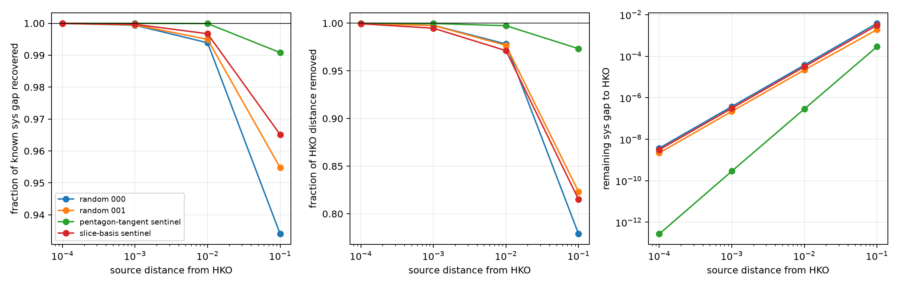
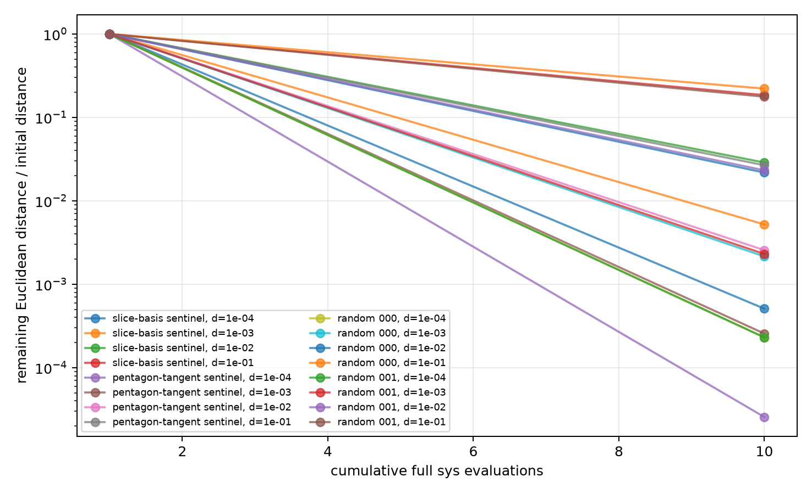
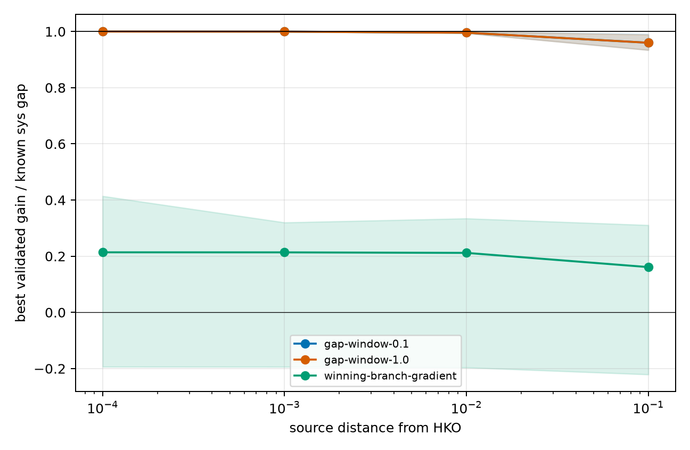
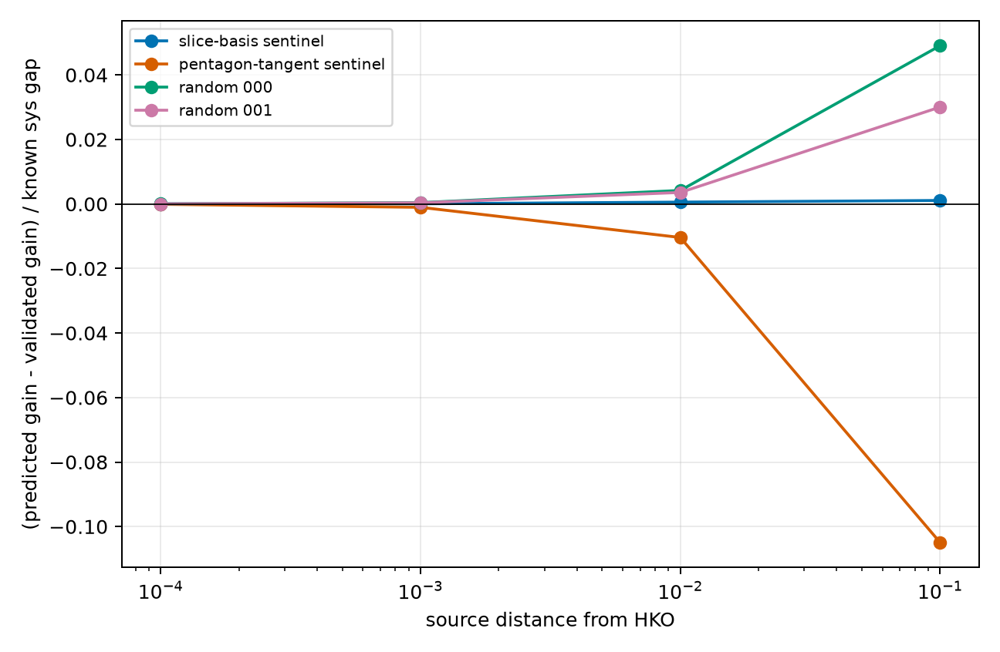
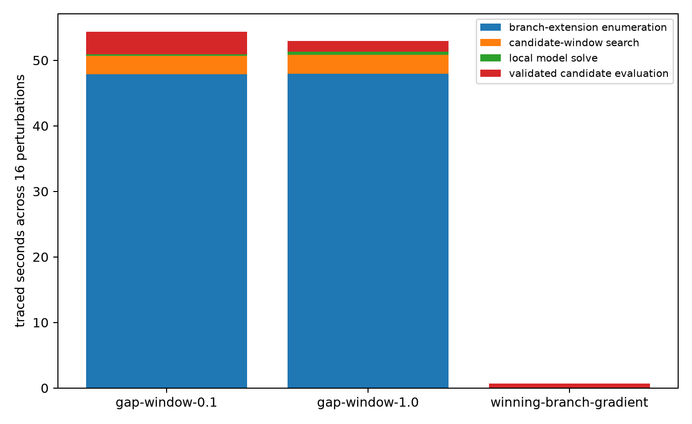

# HKO perturbation calibration

Here `sys` denotes the binary64 heuristic evaluator field used by this
diagnostic. It is not, by this report alone, a certified value of the
mathematical systolic ratio.

## Direct answer

The continuation diagnostic was tested on `16` known perturbations of
the proved HKO local maximum: four fixed directions at four controlled
Euclidean distances. HKO itself is the false-positive control.

The HKO control accepted `0` moves and changed `sys`
by `0`. The perturbation panel contains
`0` complete misses and `0` states that recovered less
than half of their known `sys` gap in one move.

The quantities below distinguish three statements that the earlier endpoint
screen conflated: a validated improvement exists, the tested method can find
it, and the method removes a substantial fraction of the known gap and
distance.

## Distance dependence

- distance `1e-04`: recovered sys-gap fraction `1`–`1`; removed distance fraction `0.999`–`1`.
- distance `1e-03`: recovered sys-gap fraction `0.999`–`1`; removed distance fraction `0.995`–`1`.
- distance `1e-02`: recovered sys-gap fraction `0.994`–`1`; removed distance fraction `0.971`–`0.997`.
- distance `1e-01`: recovered sys-gap fraction `0.934`–`0.991`; removed distance fraction `0.779`–`0.973`.

At distance `1e-1`, the single move leaves a `sys` gap of
`0.000288`–`0.00388`.
Those four residual states are the highest-value population for testing
additional moves; repeating near-HKO moves for all 16 states was
computationally wasteful.

## Which proposal machinery mattered

The two multi-branch models recover essentially the same gap. Across all 16
states, changing the candidate window from `0.1` to `1.0` changes the recovered
gap fraction by `-0.00216` to
`5.24e-07`. The wider model therefore adds no
scientifically meaningful recovery on this panel.

The current minimizing-branch gradient is qualitatively worse: its best tested
move recovers between `-0.221` and `0.414` of the
known gap, and is negative on the rotated-pentagon tangent. This is the
expected ridge failure: the differentiated branch ceases to control the
minimum after moving.

For the `0.1` branch model, prediction error on the best tested move ranges
from `-0.105` to `0.0491` of the known
gap. Its magnitude grows with source distance and depends strongly on
direction, but the validated gain remains positive in every case.

## Measured cost

The completed run took `140.1` wall seconds and
`214` full `sys` evaluations. Every perturbation used ten:
one initial evaluation and three distances for each of the two branch models
and the current-branch gradient. HKO used 54 because no model move improved and
the signed-basis fallback ran.

For the 16 perturbations, each branch-window model independently spent about
`50.7` seconds building
its branches. Keeping the empirically redundant `1.0` window accounts for
`52.5` directly traced seconds, before counting its
share of untraced HKO model construction. Branch-extension enumeration, not
the local max-min solve or the final validated evaluator calls, is the measured
hotspot.

An earlier attempt allowed three accepted moves for every perturbation. It was
stopped without a final summary after `706.58` CPU seconds and `11:47` wall
time. The partial rows were not retained as evidence. The failure mechanism
was visible before termination: after a first move had nearly reached HKO, the
program rebuilt both full branch windows at the original source-distance
schedule to obtain gains below `1e-7`. The one-step panel above is the corrected
measurement.

## Evidence boundary

These four directions were selected before this run to expose a slice-basis
direction, a structured shallow direction, and two random directions. They are
a development calibration set, not an estimate of the probability of missing
an arbitrary improving direction. The remaining retained random rays have not
been used here and can serve as a held-out panel after the proposal rules and
distance schedule are frozen.

An accepted move is fully re-evaluated and is strong evidence of ascent for
that state. A stop is only a false-negative observation relative to the known
HKO gap; it is not evidence of local maximality. A population likelihood for a
stop requires the held-out panel. Thus this run substantially raises confidence
that the multi-branch diagnostic distinguishes HKO from these controlled
perturbations, but it does not assign a miss probability to an arbitrary
optimizer endpoint.
