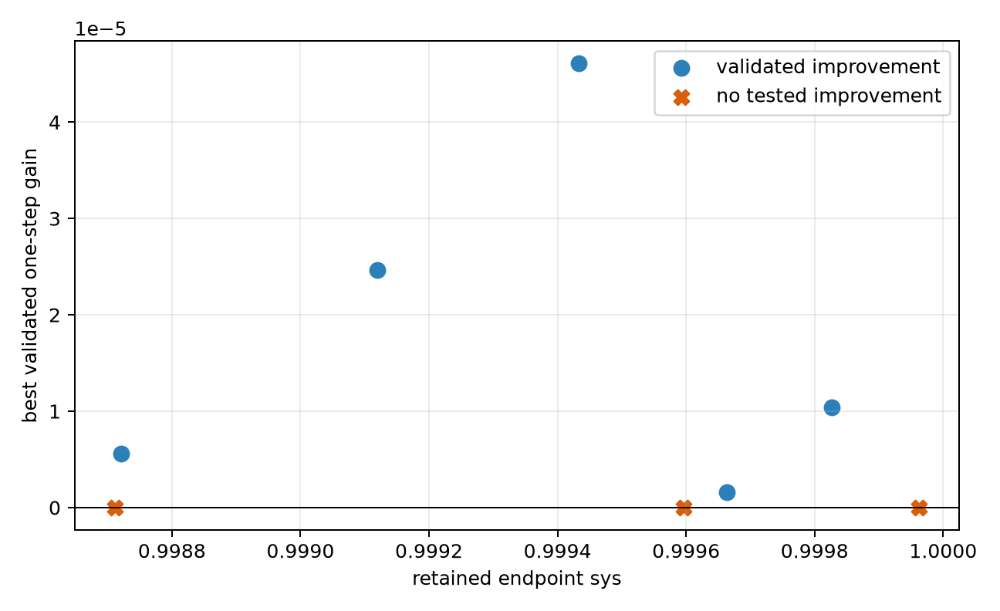
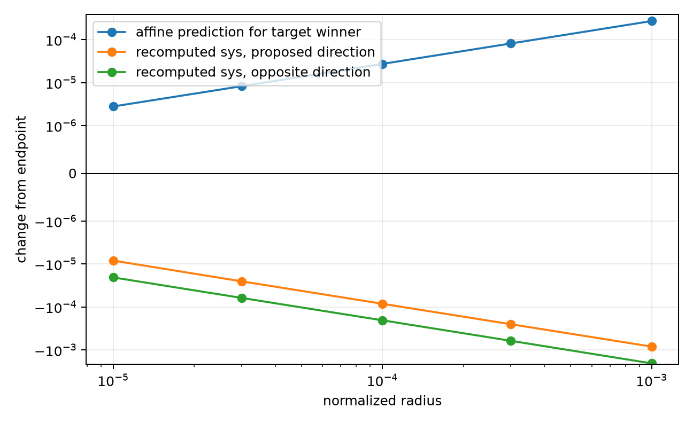

# One-step continuation of the eight highest retained endpoints

Here `sys` denotes the binary64 heuristic evaluator field used by this
diagnostic. It is not, by this report alone, a certified value of the
mathematical systolic ratio; “crossing one” refers only to that recorded
field.

## Direct answer

The highest endpoint had `sys = 0.999962478`. Neither finite-gap
max--min branch model, the five current-winning-branch gradient moves, nor any
of the 50 signed quotient-basis probes improved it; the least negative tested
change was `-3.24515353e-06`.

Across the eight outcome-selected endpoints, 5/8 had a validated
improving branch-model move, 3/8 had no improvement in the tested
models or basis, and 0/8 crossed `sys = 1`. The five gains were
between `1.57114391e-06` and
`4.60807882e-05`.

## Endpoint rows

| rank/start | initial sys | outcome | gain | selected model/radius | best tested delta | full sys evaluations |
| --- | ---: | --- | ---: | --- | ---: | ---: |
| `rank-001--random_F10_s0_12` | 0.999962478 | no tested improvement | 0 | -- | -3.24515353e-06 | 66 |
| `rank-002--random_F10_s1_4` | 0.999826614 | improved | 1.04153253e-05 | `gap-window-1.0` / 0.0003 | 1.04153253e-05 | 16 |
| `rank-003--random_F10_s3_32` | 0.9996636 | improved | 1.57114391e-06 | `gap-window-1.0` / 1e-05 | 1.57114391e-06 | 16 |
| `rank-004--random_F10_s1_6` | 0.999596801 | no tested improvement | 0 | -- | -2.21643309e-06 | 66 |
| `rank-005--random_F10_s3_31` | 0.999432797 | improved | 4.60807882e-05 | `gap-window-0.1` / 0.001 | 4.60807882e-05 | 16 |
| `rank-006--random_F10_s2_26` | 0.999119433 | improved | 2.46858928e-05 | `gap-window-1.0` / 0.001 | 2.46858928e-05 | 16 |
| `rank-007--random_F10_s0_22` | 0.998720805 | improved | 5.62957246e-06 | `gap-window-0.1` / 1e-05 | 5.62957246e-06 | 16 |
| `rank-008--random_F10_s3_8` | 0.998710939 | no tested improvement | 0 | -- | -2.4022352e-06 | 66 |

## Why the top endpoint's branch proposal failed

The evaluator's displayed winning branch at the proposed target was already
in the base branch set at 5/5 radii. Its affine
model predicted an increase at every radius, but recomputation of the
evaluator's `sys` field decreased with normalized slopes
`-0.160440233`--`-0.158221372`.
The opposite direction also decreased, with slopes
`-0.391276021`--`-0.388813515`.

Only 2/5 proposed points changed the
recorded incidence signature. The nonvanishing error per unit distance down
to radius `1e-5` is evidence against ordinary quadratic Taylor remainder for
the complete implemented affine model along these proposals. The base also
had one indeterminate vertex count, but this aggregate count does not by
itself establish a primal incidence boundary. The failure could instead lie
in the capacity derivative, volume derivative, KKT/admissibility regime, or
model bookkeeping. It does not decide whether another oblique direction
improves the endpoint.

## The affine failure across all eight endpoints

The top-endpoint mismatch is not isolated. Of
80 action-window max--min proposals,
52 decreased the recomputed evaluator `sys` field. In all
52 of those losses, the target winner was
represented in the base or extension branch set and its recorded affine
prediction was positive. 46 losses retained
the same recorded incidence, and 40 had
determinate geometry at both endpoints as well as unchanged incidence. All
40 of
40 current-winning-branch gradient proposals
decreased the recomputed evaluator `sys` field.

| rank/start | max--min gains | max--min losses | losses with unchanged clean geometry | winning-gradient losses |
| --- | ---: | ---: | ---: | ---: |
| `rank-001--random_F10_s0_12` | 0/10 | 10/10 | 0/10 | 5/5 |
| `rank-002--random_F10_s1_4` | 10/10 | 0/10 | 0/0 | 5/5 |
| `rank-003--random_F10_s3_32` | 2/10 | 8/10 | 6/8 | 5/5 |
| `rank-004--random_F10_s1_6` | 0/10 | 10/10 | 10/10 | 5/5 |
| `rank-005--random_F10_s3_31` | 6/10 | 4/10 | 4/4 | 5/5 |
| `rank-006--random_F10_s2_26` | 8/10 | 2/10 | 2/2 | 5/5 |
| `rank-007--random_F10_s0_22` | 2/10 | 8/10 | 8/8 | 5/5 |
| `rank-008--random_F10_s3_8` | 0/10 | 10/10 | 10/10 | 5/5 |

Rank 2 is an internal positive control: all ten max--min proposals improved.
Ranks 4 and 8 are clean failure controls: all ten max--min proposals decreased
with determinate, unchanged recorded geometry. This pattern favors a
systematic derivative, KKT-branch-identity, admissibility, or bookkeeping
problem over an explanation special to the top endpoint.

## Cost and interpretation

The run took `20.0855969` seconds and
`278` full evaluator calls.
An endpoint that accepted a max--min branch-model move used 16 evaluations:
one base evaluation plus ten max--min and five winning-gradient proposals.
A model stop triggered the 50-direction signed-basis fallback and used 66.

The endpoint population is the top eight outcomes of the retained 128-start
tuning dataset for `nonlinear-linearized-w3e-1-beta3e-1-h4-n2-d1e-1`. It is deliberately
outcome-selected discovery evidence, not a held-out optimizer comparison.
A validated gain proves only that the corresponding endpoint admitted a finite
improving move under this evaluator.
No tested improvement does not establish local maximality: the known
rotated-pentagon control shows that both a signed basis and sparse generic
directions can miss a thin improving set.

The top endpoint therefore remains a numerical near-one local-max candidate,
not a classified local maximum. A larger continuation run is not useful for
that state until a richer direction or branch-completeness hypothesis is
specified; repeating the same radii would reproduce the same stop.
