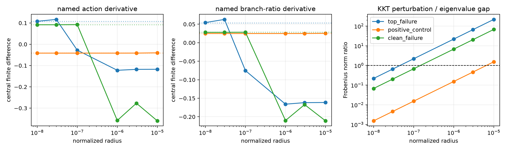

# Directional derivative decomposition

## Question

Why do two proposals decrease the implemented evaluator output even though
the branch that wins at the proposed point was present in the source candidate
set and its affine model predicted an increase?

## Result

At the optimizer's normalized radius `1e-05`,
the error is in the finite-distance linearization of the named KKT action, not
in volume, geometry reconstruction, or a missing target winner. The two
failures perturb their named KKT matrices by 67 and 218 times the smallest
base eigenvalue magnitude and cross a zero eigenvalue. Their action model even
predicts the wrong sign. The success perturbs its matrix by 1.53 times that
gap, does not cross zero, and retains the correct sign.

| role | evaluator delta | predicted named-branch delta | actual named-branch delta | action derivative error | volume derivative error | KKT perturbation / gap | eigenvalue changes sign |
| --- | ---: | ---: | ---: | ---: | ---: | ---: | --- |
| `top_failure` | -8.29301e-06 | 2.79729e-06 | -8.29467e-06 | 1.90866 | 2.36513e-09 | 217.847 | yes |
| `positive_control` | 5.95077e-07 | 8.56443e-07 | 5.95077e-07 | 0.0322895 | 1.96541e-08 | 1.52642 | no |
| `clean_failure` | -5.98289e-06 | 1.10414e-06 | -6.01471e-06 | 1.25454 | 1.15583e-08 | 67.4055 | yes |

The analytical derivative itself is not a sign-error implementation. At the
diagnostic radius `1e-08`, after the KKT
perturbation is small relative to its eigenvalue gap, finite differences
converge to the analytical derivative:

| role | action derivative error | branch-ratio derivative error | f64/exact geometry agrees at every point |
| --- | ---: | ---: | --- |
| `top_failure` | 0.00992401 | 0.0188395 | yes |
| `positive_control` | 4.15745e-07 | 7.55161e-07 | yes |
| `clean_failure` | 7.83342e-05 | 0.000135525 | yes |

The dotted lines in the first two panels are the analytical derivatives. The
third panel compares the Frobenius norm of the KKT matrix perturbation with
the smallest base eigenvalue magnitude; the dashed line marks ratio one.

Across all 39 base and perturbed points, f64 and exact-arithmetic
reconstruction agree on incidence, facet intersections, and omega signs. The
largest relative f64/exact-arithmetic volume difference is below `1e-15`.
Thus these three cases provide no evidence that geometry reconstruction
caused the failures.

## Optimizer consequence

A Euclidean radius alone is not a sufficient trust scale for an affine
named-branch action model. A cheap proposed-point check can instead compare
the KKT matrix change with the source matrix's smallest eigenvalue magnitude,
or directly re-solve the named branches and reject a move whose realized
model value disagrees. This experiment does not yet calibrate a population
threshold or establish which check yields the best compute-versus-improvement
tradeoff.

## Interpretation boundary

This is a three-proposal, outcome-selected named-branch diagnostic. Agreement
at very small radius only diagnoses the derivative formula's local limit; a
normalized radius of `1e-8` is not proposed as an optimizer step. The result
does not establish candidate-family completeness, mathematical capacity,
endpoint stationarity, population frequency, or a final trust policy. The
Rust producer records the one-sided curves, KKT spectra and residuals, beta
vectors, geometry counters, and f64/exact-arithmetic comparisons in
`audit.json`.
