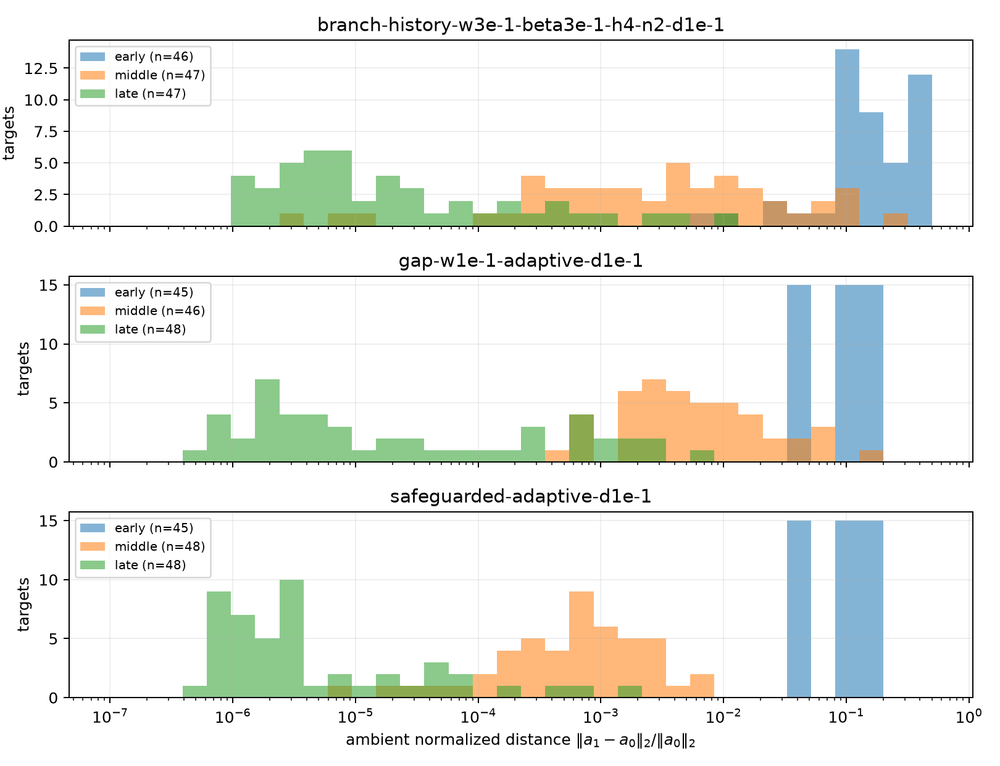
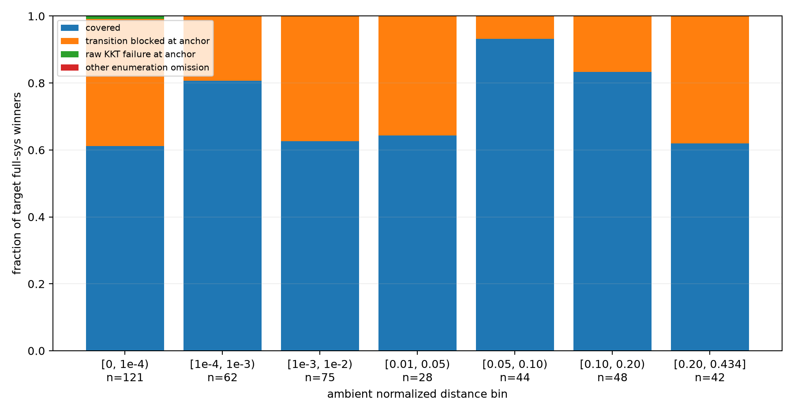
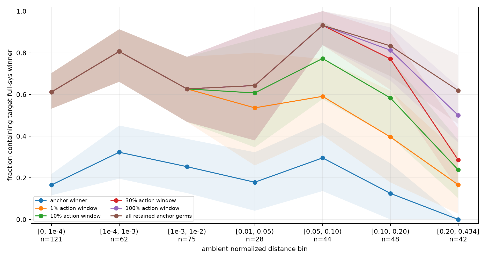
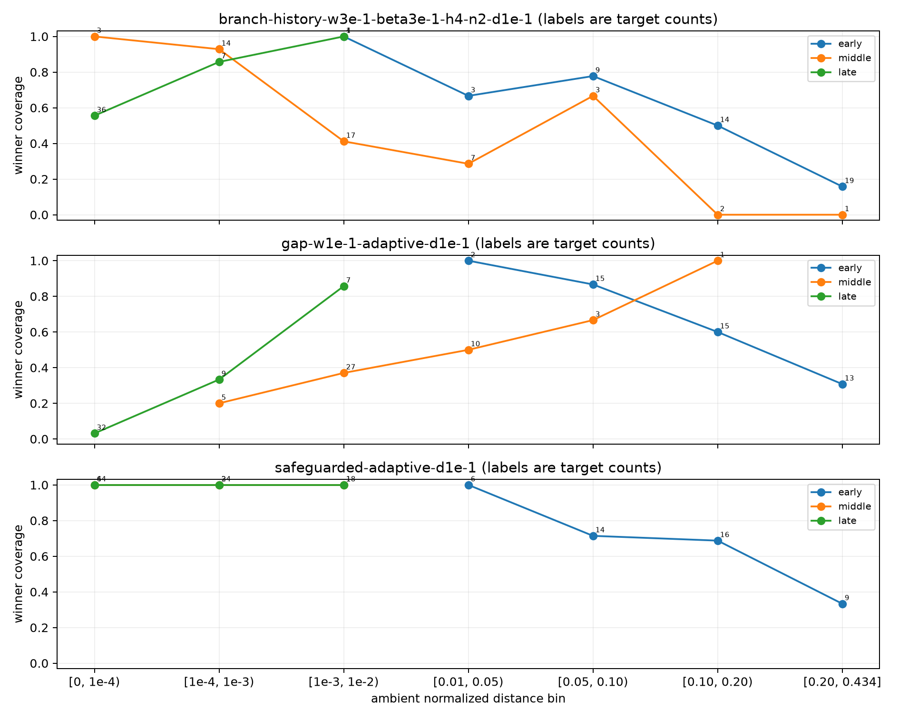
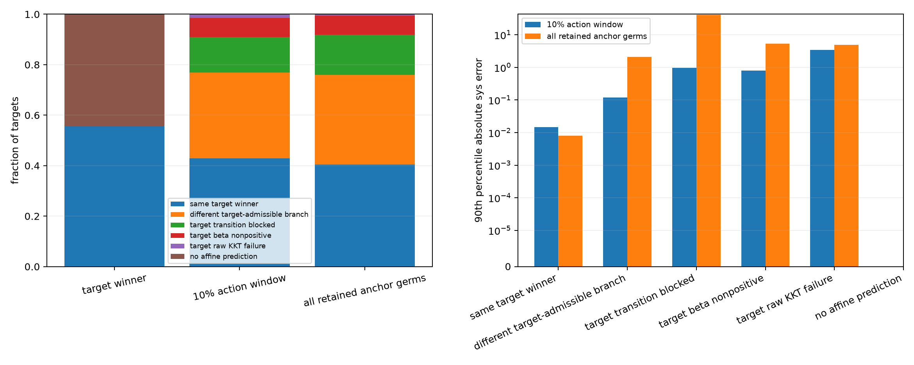
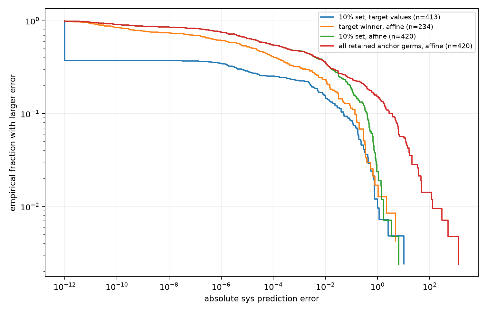
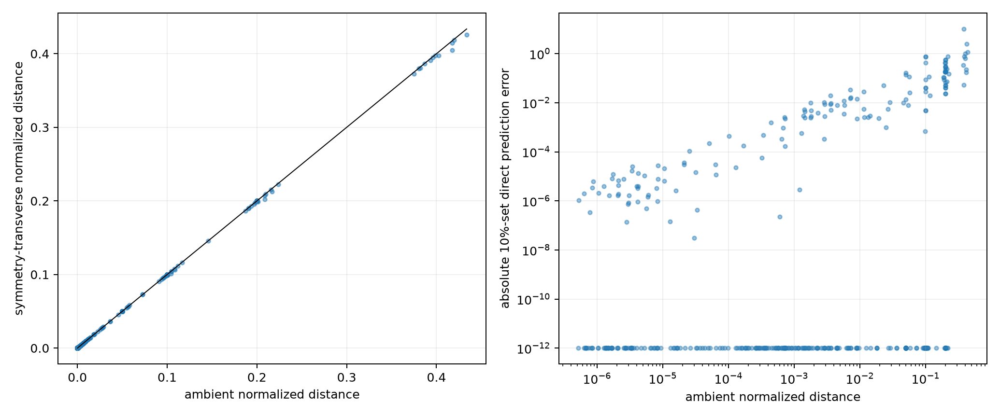
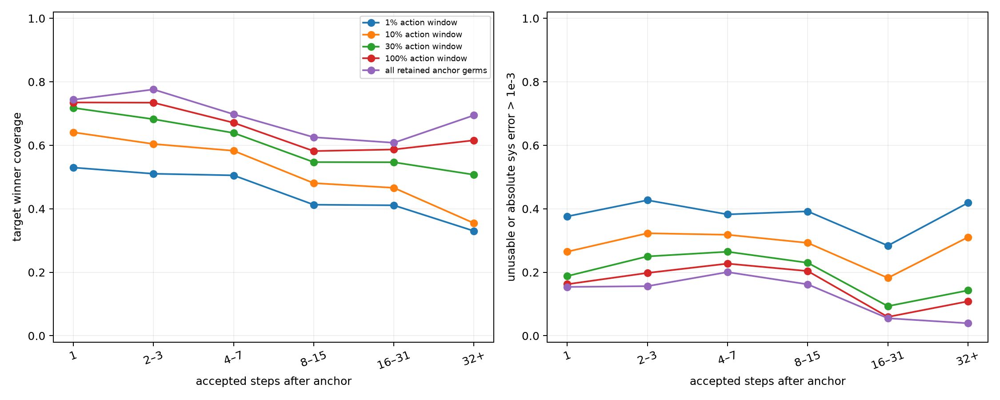
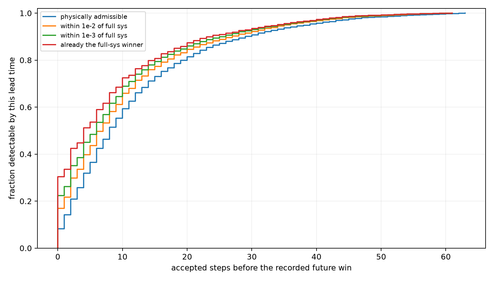

# Predictor and candidate-set diagnostics

## Result in one page

This is a replay of 144 selected on-trajectory moves from 48 F=10 development runs (16 starts and three optimizers), at 0.5, 1, and 2 times each recorded displacement. It produced 432 target evaluations, of which 420 were usable.

The main conclusions are:

- **Reevaluating retained branches works when the right branch is present.** Across 2286 rows where a named set contained the target full-sys winner, the largest recorded error was 0. All 420 target-universe controls also reproduced full sys.
- **Transition change, not the action window, is the dominant hard candidate-set failure.** Of 420 usable targets, 123 future winners were transition-blocked at the anchor, 1 had an anchor raw-KKT failure, and 0 were otherwise omitted. Increasing an action window cannot recover a branch that was never in the anchor transition-feasible universe.
- **A hard anchor beta cutoff would discard useful branches.** 76/420 future winners had nonpositive raw normalized beta at the anchor.
- **Frozen-domain affine prediction has two independent failures.** The target-winning branch was representable at the anchor in only 234/420 rows. Even then, finite-distance same-branch affine error had a long tail; allowing many affine branches also selected branches that were transition-blocked or beta-nonpositive at the target.
- **Candidate history is useful, but does not make a stale set reliable.** Future winners were often detectable several accepted steps before becoming the winner, while one-step-back detection was incomplete. This supports remembering newly observed winners and retroactive diagnostics, but not replacing refreshes with an indefinitely growing anchor set.

These are predictor diagnostics, not a full optimizer comparison. They say which approximations fail and which state a practical optimizer should refresh; they do not establish long-run improvement per compute.

## Data and definitions

Source dataset: `experiments/dev-gradient-ascent/optimizer-atoms/artifacts/development-f10-16-replay`.

Status counts: `indeterminate_geometry` 1, `invalid` 12, `ok` 419.

The ambient normalized distance is

\[d(a_0,a_1)=\frac{\lVert a_1-a_0\rVert_2}{\lVert a_0\rVert_2}.\]

The symmetry-transverse distance projects the displacement away from the 15 infinitesimal symmetry directions computed at the anchor before taking the same ratio. Candidate sets use unrestricted f64 raw KKT germs from transition-feasible anchor sigma; the action window applies no beta cutoff. Named branches are reevaluated at the target with target transition and beta admissibility.



## Why future winning branches are absent



| anchor status of target winner | count | fraction |
|---|---:|---:|
| present in anchor universe | 296 | 0.7048 |
| transition-blocked | 123 | 0.2929 |
| raw-KKT failure | 1 | 0.002381 |
| other enumeration omission | 0 | 0 |

The absence of `other enumeration omission` is a useful diagnostic: the current enumeration plumbing usually finds a raw germ when the target winner is already transition-feasible at the anchor. The main hard failure for this anchor-candidate rule in this sample is a transition becoming feasible later.

Action-window coverage of the target winner:

| candidate set | pooled winner coverage | median candidates | median measured cost / full sys |
|---|---:|---:|---:|
| 1% action window | 0.5667 | 207 | 0.2113 |
| 10% action window | 0.619 | 302 | 0.3079 |
| 30% action window | 0.6643 | 429 | 0.4135 |
| 100% action window | 0.6905 | 607 | 0.5503 |
| all retained anchor germs | 0.7048 | 808 | 0.6922 |





The stratified plot is important: optimizer and trajectory phase are confounded with distance, and some cells are sparse. Pooled curves are descriptive, not an iid estimate over arbitrary points.

## What makes affine predictions fail

For each affine envelope prediction, the trace now records the sigma selected by the affine minimum and reevaluates that sigma at the target. This separates finite-distance error of that selected branch from selecting a branch outside its target physical domain.



| 10% affine-set outcome | fraction | median absolute envelope error | 90% error | maximum error |
|---|---:|---:|---:|---:|
| same target winner | 0.4286 | 1.719e-06 | 0.01465 | 0.6696 |
| different target-admissible branch | 0.3405 | 0.003488 | 0.1179 | 0.9521 |
| target transition blocked | 0.1405 | 0.04792 | 0.9757 | 1.669 |
| target beta nonpositive | 0.07619 | 0.2847 | 0.7957 | 3.333 |
| target raw KKT failure | 0.01429 | 0.2196 | 3.417 | 6.436 |

The `target winner only` control removes wrong-branch selection. Its remaining errors are same-branch finite-distance affine errors. A missing control prediction is explained almost entirely by the target winner being transition-blocked or beta-nonpositive at the anchor; this is a domain change, not merely a poor linear fit.

The all-anchor-germs affine envelope is worse than the 10% envelope: more branches create more opportunities for an extreme extrapolation from a branch that is no longer physical. Thus including more branches is monotone-safe for direct target reevaluation, but not for a frozen-domain affine minimum.



## Distance and candidate lifetime



Here the symmetry projection barely changes the moves: the ratio of symmetry-transverse to ambient distance has median 1 and 10th percentile 0.9987. For classifying a 10%-set direct error above 1e-2, ambient-distance AUC is 0.9094 and symmetry-transverse-distance AUC is 0.912. The quotient projection adds essentially no information on this trajectory sample.

Candidate lifetime is measured on later accepted trajectory states, not on scaled off-shell replay points. Each anchor-selected set is directly reevaluated at those states.



| accepted steps after anchor | 10% coverage | 10% material error | all-germs coverage | all-germs material error | median ambient distance |
|---|---:|---:|---:|---:|---:|
| 1 | 0.641 | 0.265 | 0.7436 | 0.1538 | 0.004547 |
| 2–3 | 0.6042 | 0.3229 | 0.776 | 0.1562 | 0.03034 |
| 4–7 | 0.5829 | 0.3182 | 0.6979 | 0.2005 | 0.06264 |
| 8–15 | 0.4808 | 0.2927 | 0.6254 | 0.162 | 0.169 |
| 16–31 | 0.4661 | 0.1822 | 0.6081 | 0.05508 | 0.1801 |
| 32+ | 0.3547 | 0.3103 | 0.6946 | 0.03941 | 0.2106 |

Coverage generally decays with accepted-step age, but value error is not monotone because late trajectories, optimizer family, anchor phase, and distance are mixed. Therefore accepted-step count alone is not a sufficient refresh trigger.

## What retroactive branch checks can reveal

For every later accepted state, the branch that wins there was reevaluated at every preceding accepted state back to the selected anchor. The lead time is how many accepted steps before its recorded win the branch first became admissible, close in value, or already winning.



| population | future targets | previous step admissible | previous step within 1e-2 | previous step within 1e-3 | median admissible lead | median 1e-2 lead | median 1e-3 lead | median winner lead |
|---|---:|---:|---:|---:|---:|---:|---:|---:|
| pooled | 1932 | 0.7013 | 0.5864 | 0.4084 | 8 | 7 | 6 | 4 |
| branch-history-w3e-1-beta3e-1-h4-n2-d1e-1 | 601 | 0.5108 | 0.4476 | 0.3794 | 6 | 5 | 4 | 2 |
| gap-w1e-1-adaptive-d1e-1 | 482 | 0.4544 | 0.334 | 0.2552 | 6 | 4 | 3 | 2 |
| safeguarded-adaptive-d1e-1 | 849 | 0.9764 | 0.828 | 0.5159 | 13 | 12 | 10 | 10 |

This supports a cheap diagnostic after discovering a new winner: check that sigma at recent saved states to locate when the previous candidate set became value-wrong. It does not itself repair the already-taken trajectory, and the result is conditional on trajectories produced by the existing optimizers.

## Prediction error relative to the proposed gain

The denominator below is `max(abs(actual target sys - anchor sys), 1e-3)`. The floor prevents numerically tiny late moves from dominating the ratio.

| 10% value model | usable targets | median error/gain | 90% error/gain | error larger than gain | predicts improvement when target worsens | predicts rejection when target improves |
|---|---:|---:|---:|---:|---:|---:|
| named_branch_kkt_at_target | 413 | 0 | 1.678 | 0.1429 | 0.1525 | 0 |
| affine_named_branches_at_anchor | 420 | 0.06223 | 2.988 | 0.25 | 0.2238 | 0 |

Both models are optimistic on this selected proposal population: the observed sign error is false improvement, not false rejection. A full-sys validation before accepting a proposed move is therefore useful even when the cheap predictor is used to generate it.

## Invalid replay targets

12/432 replay targets were unusable. Their retained status and diagnostic fields are:

| status | geometry route | fallback reason | error | count |
|---|---|---|---|---:|
| invalid | failed | — | invalid_f64_geometry | 12 |

## Statistical and claim boundary

- The 16 starts are the independent population units available here. Rows from the same start, neighboring rounds, replay scales, and retroactive scans are correlated.
- The optimizer and trajectory-phase mix changes across distance and lifetime bins. The plots diagnose mechanisms; they are not a fitted universal error law.
- AUC screens only whether one scalar orders the observed material-error event. They are not calibrated refresh policies.
- Timings include target geometry and volume reconstruction for every named-set call. An implementation that reuses them will change the cost ratios.
- Long-run sys improvement per compute, endpoint local maximality, start-to-start variance, and trajectory convergence across optimizers belong to the companion full-optimizer comparison, not this predictor replay.

## Reproduction and retained tables

```bash
cargo run -p optimizer-atoms --release -- \
  --config experiments/dev-gradient-ascent/optimizer-atoms/manifests/development-f10-16.json \
  --out /tmp/development-f10-16-replay

uv run --script experiments/dev-gradient-ascent/optimizer-atoms/diagnose_replay.py \
  --dataset /tmp/development-f10-16-replay \
  --out /tmp/development-f10-16-replay-evidence
```

Machine-readable tables: `winner-causes-by-distance.csv`, `affine-causes.csv`, `candidate-lifetime.csv`, `rollback-summary.csv`, `gain-relative-error.csv`, `distance-screen.csv`, `coverage-by-distance.csv`, `candidate-miss-impact-by-distance.csv`, and `cost-coverage-by-scale.csv`.
