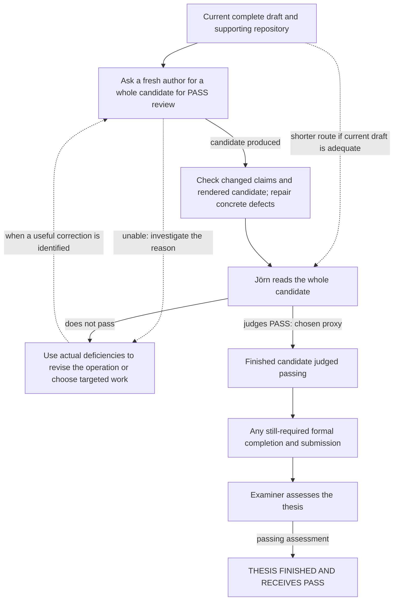

# Current work map

Updated 2026-09-11. Non-authoritative planning view; the reasons and user
decisions behind it live in [planning context](planning-context.md).
[Outcome coverage](outcome-coverage.md) retains whole-thesis composition, long
proofs, eventual delivery and new discovery findings beyond the proposed session
portfolio. It is not an exhaustive graph or additional assignment queue.

## September 11 PM session

Jörn requests continuous delegation-led project management. Completion proxy:
explicit approval from him after reading the thesis PDF that he thinks it earns
a PASS. The PM coordinates and owns small integration writes; bounded exploration
belongs to subagents. Herdr top-level launches require his approval of the actual
prompt, because he must understand and converse with those agents. Consequential
questions/results use async questions or self-contained finals, not commentary.

Current assignment: provide Jörn a provisional project task graph with the
reasons for proposed routes, rather than assert an exhaustive decomposition or
an unsupported fastest route. The communication failures remain relevant to how
this work is checked; producing this map does not certify their durable repair.
Both launch requests were withdrawn. The remaining crate inbox item was removed
using the TUI skip action without answering, and absence was checked live; the
route is in global memory `agent-coordination.md`. No launch or next-work
priority is approved.

The PDF was refreshed after the September 7 prose changes and September 11
evidence qualifications. `./thesis/check-build.sh` passed its selected PDF,
overfull-box and reference checks; rendered page 104 was also inspected.
Full-manuscript visual/scientific review remains open. Pre-existing `tmp/` is
untouched.

Jörn clarified that roughly 99% of the proposed experiment's value is learning
whether a repeatable low-cost operation produces useful thesis content; retaining
the particular revised chapter is incidental and its worktree can be discarded.
No authoring experiment or launch prompt is currently agreed. The PM withdraws
both its HKO-first and subsequent whole-thesis-attempt recommendations: it has
not justified their expected learning relative to cost. No Herdr launch is
authorized. Historical session proposals are not current launch instructions.

Authoring remains open. A single-crate quality calibration is also a current
user proposal: `algebraic-numbers` is a bounded candidate, not a demonstrated
bottleneck. Its [pilot prompt](/tmp/msc-math-prompts.JXv7AM/crate-quality-session-prompt.md) is prepared
as an unapproved draft. The PM withdrew the crate-first recommendation pending
the unresolved communication and priority discussion. Read-only assessment found repeated
solver elimination, incomplete generated nullspace checks, documentation drift,
and an endpoint-rounding conversion panic inferred from source and an independent
binary64 calculation (not a Rust regression); these are scoped candidates,
not an instruction to implement all of them. Broad refactoring and shared-skill
revisions have not been established
as prerequisites for passing.

Jörn reports that even realistic timelines have led agents to declare defeat
and attempt desperate actions, with claimed three-day work taking ten minutes.
This is his observed planning failure, not measured general model performance.
No new deadline was supplied. Sequence bounded work by its contribution and
observed cost; unsupported duration estimates do not justify defeat or shortcuts.
The remaining launch draft is temporary material under `/tmp`, not project
documentation; its path may expire after the launch decision.

## Provisional routes to a finished passing thesis

Project goal: finish the thesis with a passing grade. The user-selected operational
proxy is Jörn explicitly judging PASS after reading the PDF; this is evidence for
the goal, not a logical guarantee of the university's grade. No route or launch
is selected. The map must include a complete success story and compare proposed
steps with their omission, not merely list things that might help.

### Direct manuscript route as a comparator

This is a possible successful route, not a claim of fastest sequencing or an
exhaustive decomposition. The arrows describe what happens in this story if the
operations work. A complete 110-page draft and supporting repository exist.

The last steps are conditional on actual current requirements and status, which
have not been established; this does not reactivate old administrative tasks.
Jörn's final reading is a future decision, not assigned by drawing the arrow.

The story could work if remaining defects are identifiable and repairable using
the current material, the author/checkers can make those repairs without larger
regressions, and the finished work meets the actual assessment requirements.
The complete draft and successful bounded evidence repairs support feasibility;
they do not establish those authoring abilities, current manuscript adequacy,
convergence under feedback, or total cost. An unexplained failure does not justify
indefinitely repeating the same operation. It may call for a targeted diagnostic,
a different authoring approach, or direct human contribution instead.

### Omission comparisons

The comparison concerns impact on success and total effort, not whether both
versions have some imaginable successful outcome. These judgments apply to this
comparator route, not all possible routes.

| Proposed insertion | Downstream consumer / intended causal effect | What changes when omitted? |
| --- | --- | --- |
| Fresh authoring attempt | Full reading receives a candidate with defects repaired before Jörn spends his attention. Its observed behavior informs whether to reuse/change that operation. | Jörn could read the existing PDF instead. We have not established whether authoring saves more reading/repair effort than it costs or introduces. This is an unresolved comparison, not an automatic authoring-first priority. |
| Candidate checking | Repairs found build/rendering problems and consequential changed-claim errors before full reading. | Saves checking effort but can pass introduced defects to Jörn. Build checks and specific record-to-claim checks have concrete local evidence; broad agent review as a predictor of Jörn's judgment remains unvalidated. Scope checks to what they can actually detect. |
| HKO-only method experiment | Could supply a cheap operation for a needed HKO repair, or diagnose a failure affecting the larger operation. | The whole-candidate operation remains executable without it. No current HKO bottleneck or specific diagnostic saving establishes its place in this route. That does not imply HKO learning has no value in another supported route. |
| Single-crate quality calibration / subsequent migration | Could improve future code comprehension, evidence/figure implementation, or scientific checking, reducing manuscript-work cost and errors. | We already recovered support and made bounded wording repairs without it. Concrete code issues exist, but no effect large enough to favor inserting calibration here has been established. Count scientific regression checks and Jörn's calibration effort as costs too. Expected broad savings could justify it; an observed blockage is not the only possible justification. |
| Broad prompt/skill redesign | Could reduce failures in later work selection, authoring and feedback incorporation. | A direct authoring route remains plausible. No particular skill has been shown to cause the observed failures, and previous instruction edits did not stop recurrence. Broad redesign needs a benefit argument beyond those failures existing. |
| Narrow communication/coordination repair | Can prevent observed wrong task selection, changed user meaning, and inaccurate action-status reports from wasting later work. | This session supplies actual examples of the waste. An effective intervention or bypass could reduce it; effectiveness of the current temporary response check is not established by one reviewed reply. |
| Full reading by Jörn | Supplies the explicitly chosen PASS proxy and potentially identifies remaining deficiencies. | The selected proxy remains unobserved. Neither generated text nor agent consensus replaces it. |
| Any still-required formal completion | Makes an acceptable manuscript a formally completed thesis receiving an actual grade. | A private acceptable PDF might meet the operational proxy without completing the project externally. Whether any particular formal step remains is presently unknown. |

Candidate operations may produce reusable learning as well as a draft. For the
proposed authoring experiments, Jörn identifies the former as roughly 99% of the
value. Preserve the actual operation/context and consequential interventions when
that learning is the point. Local observations do not automatically establish
cross-chapter transfer. A candidate that already achieves the goal does not need
additional method-generalization research merely to satisfy this map.

Evidence owners for the comparisons:

- [Data evidence](datascience-scope.md): retained-record checks enabled two precise
  qualifications without rerunning producers. Historical frozen-table numerical
  guarantees remain unresolved; qualification or other scientific choices may
  suffice depending on the retained claim.
- [Authoring comparison](authoring-workflow.md): a local correction and conflicting
  exposition judgments, not evidence of human-acceptable repeatable authorship.
- [Architecture evidence](architecture-migration.md): concrete opportunities and
  scientific-contract differences, not measured savings for remaining thesis work.
- [Broader discovery](outcome-coverage.md): whole-thesis composition, long proofs,
  interpretation, source/figure maintenance and publication questions. These can
  change the route when they matter to actual remaining work.

The inspected evidence does not rank the comparator and its insertions by expected
total effort to PASS. Its decisive unresolved comparison is whether authoring and
checking save more human reading/repair effort than they consume or introduce.
That uncertainty is exposed here, not resolved by drawing a complete story.

Conditional dependencies that can actually guide work:

- A claim of preserved scientific behavior needs checks of the behavior affected
  by that change; for example complete nullspaces, arithmetic, or historical
  evaluator interpretation. This does not imply a comprehensive audit before
  every edit.
- If a specific authoring attempt is obstructed by missing evidence, an absent
  figure capability or a code defect, that obstruction can justify enabling work.
  No such observation currently justifies a global code-cleanup prerequisite.
- Local observations inform the tested operation and setting. A broader
  repeatability or transfer claim needs an argument appropriate to that claim;
  a local experiment need not establish broad transfer to have local value.

Discovery remains open: additional deficiencies, useful operations or constraints
can change this map. Revisit its edges when an attempt supplies new information;
do not treat these headings as the complete space of possible work.

## Sprint disposition and next ownership

On 2026-09-07 Jörn authorized a roughly 15-minute parallel repo-improvement
sprint, with isolated worktrees and one integration worktree. Integrated results
are reflected above. The main agent owns follow-on selection; the completed
subagent tasks do not assign anyone the remaining thesis work. No research run
or comprehensive audit is queued.

The unlimited-budget sprint is finished; normal-budget work has resumed.
All implementation commits were integrated. Branches `migration/20260907-*`
retain the worker histories after removal of their clean scratch checkouts.
The unmerged process-handoff packet is superseded by global memory, not pending
integration. The changed TeX was subsequently rebuilt on September 11; full visual review
remains open.

The migration purpose is predictable tools, useful navigation and enough
accurate context for fresh agents to avoid costly wrong work. It does not
certify the thesis or settle every research question.

## Completed work: evidence owners

- [Migration review](../docs/migration-review.md): assignment-clarity repair,
  obsolete-guidance removal, scratch preservation/removal and recovery pointers.
- [INSTALL](../INSTALL.md) and [environment evidence](../docs/development-environments.md):
  named environment/Sage checks and their limits; not comprehensive reproduction.
- [HKO author context](hko-author-context.md) and
  [optimizer review route](optimizer-review-route.md): bounded memory pilots.
  [Planning context](planning-context.md#bounded-checks) records what their
  retrieval check did and did not establish.
- [Gradient method](../experiments/dev-gradient-ascent/METHOD-CANDIDATE.md) and
  [package README](../experiments/dev-gradient-ascent/README.md#directory-map):
  algorithm and recovery/support limits after charter/promotion-packet removal.
- [P2 packet](../experiments/sys-datascience/methods/standard-baseline-p2/README.md):
  completed input reconstruction with matching hashes, including unauthorized
  CPU-load incident and resource warning. No rerun queued.
- Global installation/distribution remains DevOps-owned. Jörn separately
  authorized this sprint's live shared-skill edits: memory/skill-design writing
  guidance was refined, not reorganized into a new framework. The remaining
  cross-skill design question lives in global memory
  `~/.agents/memories/process-knowledge-design.md`.

## Not assigned by this map

Broad proof audit, archive publication and administrative verification are not
current migration assignments. A local-maxima-screen rerun is not queued; the
missing historical producer state is already disclosed in the thesis.
Current deadline/submission status remains unestablished here; old pending
administrative notes are not current tasks. See
[project facts](../docs/project-facts.md) for dated scope and submission context.
