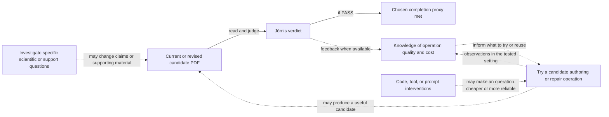

# Current work map

Updated 2026-09-11. Non-authoritative planning view; the reasons and user
decisions behind it live in [planning context](planning-context.md).
[Outcome coverage](outcome-coverage.md) retains whole-thesis composition, long
proofs, eventual delivery and new discovery findings beyond the proposed session
portfolio. It is not an exhaustive graph or additional assignment queue.

## September 11 PM session

Jörn requests continuous delegation-led project management. Completion proxy:
explicit approval from him after reading the thesis PDF that he thinks it earns
a PASS. The PM coordinates and owns small integration writes; bounded exploration
belongs to subagents. Herdr top-level launches require his approval of the actual
prompt, because he must understand and converse with those agents. Consequential
questions/results use async questions or self-contained finals, not commentary.

Current assignment: provide Jörn a provisional project task graph with the
reasons for proposed routes, rather than assert an exhaustive decomposition or
an unsupported fastest route. The communication failures remain relevant to how
this work is checked; producing this map does not certify their durable repair.
Both launch requests were withdrawn. The remaining crate inbox item was removed
using the TUI skip action without answering, and absence was checked live; the
route is in global memory `agent-coordination.md`. No launch or next-work
priority is approved.

The PDF was refreshed after the September 7 prose changes and September 11
evidence qualifications. `./thesis/check-build.sh` passed its selected PDF,
overfull-box and reference checks; rendered page 104 was also inspected.
Full-manuscript visual/scientific review remains open. Pre-existing `tmp/` is
untouched.

Jörn clarified that roughly 99% of the proposed experiment's value is learning
whether a repeatable low-cost operation produces useful thesis content; retaining
the particular revised chapter is incidental and its worktree can be discarded.
No authoring experiment or launch prompt is currently agreed. The PM withdraws
both its HKO-first and subsequent whole-thesis-attempt recommendations: it has
not justified their expected learning relative to cost. No Herdr launch is
authorized. Historical session proposals are not current launch instructions.

Authoring remains open. A single-crate quality calibration is also a current
user proposal: `algebraic-numbers` is a bounded candidate, not a demonstrated
bottleneck. Its [pilot prompt](/tmp/msc-math-prompts.JXv7AM/crate-quality-session-prompt.md) is prepared
as an unapproved draft. The PM withdrew the crate-first recommendation pending
the unresolved communication and priority discussion. Read-only assessment found repeated
solver elimination, incomplete generated nullspace checks, documentation drift,
and an endpoint-rounding conversion panic inferred from source and an independent
binary64 calculation (not a Rust regression); these are scoped candidates,
not an instruction to implement all of them. Broad refactoring and shared-skill
revisions have not been established
as prerequisites for passing.

Jörn reports that even realistic timelines have led agents to declare defeat
and attempt desperate actions, with claimed three-day work taking ten minutes.
This is his observed planning failure, not measured general model performance.
No new deadline was supplied. Sequence bounded work by its contribution and
observed cost; unsupported duration estimates do not justify defeat or shortcuts.
The remaining launch draft is temporary material under `/tmp`, not project
documentation; its path may expire after the launch decision.

## Provisional outcome and route graph

Project goal: finish the thesis with a passing grade. The user-selected operational
proxy is Jörn explicitly judging PASS after reading the PDF. That proxy is not an
assertion about the university's eventual grade. The current candidate already
exists; this map does not assume another revision must precede its evaluation.

The graph shows candidate routes currently under discussion, not all possible
routes or an AND-decomposition of the goal. Solid arrows express the chosen
proxy's observation sequence. Dashed arrows are possible effects or feedback,
not established benefits, required dependencies, or assignments.

These are current options and open questions. A row is not an obligation to run
that work; a particular attempt may combine rows or reveal a better route.

| Candidate work | Evidence making it a live option | Argument for shortening the route, and what remains unestablished |
| --- | --- | --- |
| Assess a candidate and choose useful feedback | A current PDF and build route exist. Build/reference checks, page 104 visual inspection and selected empirical aggregates have passed; full-manuscript quality is unestablished. | Targeted checks may save Jörn reading an already-defective candidate. No automated final-quality proxy is established. A good checked excerpt cannot certify unrelated chapters. This map does not itself request a full-PDF reading. |
| Try an authoring operation and learn whether to reuse it | A fresh-agent HKO revision or whole-thesis attempt are concrete candidate operations. Prior HKO work produced a local correction and conflicting exposition judgments, without a human before/after assessment. | Reliable inexpensive production would reduce later authoring cost. Neither repeatability, cost, nor transfer has been established for the proposed operations. HKO is not a proven PASS bottleneck; wider scope alone does not establish value. No experiment is selected. |
| Resolve a specific scientific/content/support question | Frozen-table historical evaluator lineage is unresolved; current prose describes recorded values. Appendix aggregates were checked and two qualifications integrated. Whole-thesis explanation, long-proof readability, conventions, figures and interpretation remain incompletely assessed, not demonstrated defective. | Existing evidence may support an accurate account without new research. Depending on the actual claim, recovery, correction, qualification, omission, or no change may suffice. The completed checks do not validate all producers or prove that more experiments would help. See [data evidence](datascience-scope.md) and [broader discovery](outcome-coverage.md). |
| Calibrate ordinary code quality on one crate; perform targeted migration where useful | `algebraic-numbers` has concrete source-level opportunities: repeated elimination, incomplete generated nullspace checks, documentation drift and an inferred conversion panic. Other migration candidates and scientific differences are documented. | Jörn's hypothesis is that learning an efficient multi-dimensional quality process can reduce future mistakes, search and implementation effort. Current code findings make it concrete, but no measured authoring benefit or cross-crate reliability follows. No blanket refactor-before-writing dependency is established. See [architecture evidence](architecture-migration.md). |
| Repair costly prompt/skill/coordination failures | This session exhibited changed meaning, unsupported historical attribution, task substitution and inaccurate action-status reporting. Global communication guidance was corrected; those edits alone did not stop subsequent failures. | A successful narrow intervention could reduce repeated waste across project work. A particular skill's causal contribution and the benefit of broad instruction redesign are unestablished. Current response review is a local check, not proof of a durable cure. |
| Close actual delivery and reproduction obligations when relevant | Current manuscript disclaims full plain-checkout reproduction and a frozen DOI. Archive actions remain unverified. Recorded advisor/submission sequence is dated context, not current status. | Check actual retained promises and current requirements before doing closure work. Full archive publication is not established as a prerequisite to the chosen PASS proxy. Do not reactivate old deadlines or administrative tasks from the graph. |

The inspected evidence does not rank HKO-first, whole-thesis-first and crate-first
by expected total effort to PASS. Concreteness or ease of testing alone is not
that ranking. An argument for selecting one should explain the useful result or
learning it is expected to buy, the effort/intervention it consumes, and how that
changes the remaining route. This does not require an exhaustive probability or
evidence derivation from Jörn.

Conditional dependencies that can actually guide work:

- A claim of preserved scientific behavior needs checks of the behavior affected
  by that change; for example complete nullspaces, arithmetic, or historical
  evaluator interpretation. This does not imply a comprehensive audit before
  every edit.
- If a specific authoring attempt is obstructed by missing evidence, an absent
  figure capability or a code defect, that obstruction can justify enabling work.
  No such observation currently justifies a global code-cleanup prerequisite.
- Local observations inform the tested operation and setting. A broader
  repeatability or transfer claim needs an argument appropriate to that claim;
  a local experiment need not establish broad transfer to have local value.

Discovery remains open: additional deficiencies, useful operations or constraints
can change this map. Revisit its edges when an attempt supplies new information;
do not treat these headings as the complete space of possible work.

## Sprint disposition and next ownership

On 2026-09-07 Jörn authorized a roughly 15-minute parallel repo-improvement
sprint, with isolated worktrees and one integration worktree. Integrated results
are reflected above. The main agent owns follow-on selection; the completed
subagent tasks do not assign anyone the remaining thesis work. No research run
or comprehensive audit is queued.

The unlimited-budget sprint is finished; normal-budget work has resumed.
All implementation commits were integrated. Branches `migration/20260907-*`
retain the worker histories after removal of their clean scratch checkouts.
The unmerged process-handoff packet is superseded by global memory, not pending
integration. The changed TeX was subsequently rebuilt on September 11; full visual review
remains open.

The migration purpose is predictable tools, useful navigation and enough
accurate context for fresh agents to avoid costly wrong work. It does not
certify the thesis or settle every research question.

## Completed work: evidence owners

- [Migration review](../docs/migration-review.md): assignment-clarity repair,
  obsolete-guidance removal, scratch preservation/removal and recovery pointers.
- [INSTALL](../INSTALL.md) and [environment evidence](../docs/development-environments.md):
  named environment/Sage checks and their limits; not comprehensive reproduction.
- [HKO author context](hko-author-context.md) and
  [optimizer review route](optimizer-review-route.md): bounded memory pilots.
  [Planning context](planning-context.md#bounded-checks) records what their
  retrieval check did and did not establish.
- [Gradient method](../experiments/dev-gradient-ascent/METHOD-CANDIDATE.md) and
  [package README](../experiments/dev-gradient-ascent/README.md#directory-map):
  algorithm and recovery/support limits after charter/promotion-packet removal.
- [P2 packet](../experiments/sys-datascience/methods/standard-baseline-p2/README.md):
  completed input reconstruction with matching hashes, including unauthorized
  CPU-load incident and resource warning. No rerun queued.
- Global installation/distribution remains DevOps-owned. Jörn separately
  authorized this sprint's live shared-skill edits: memory/skill-design writing
  guidance was refined, not reorganized into a new framework. The remaining
  cross-skill design question lives in global memory
  `~/.agents/memories/process-knowledge-design.md`.

## Not assigned by this map

Broad proof audit, archive publication and administrative verification are not
current migration assignments. A local-maxima-screen rerun is not queued; the
missing historical producer state is already disclosed in the thesis.
Current deadline/submission status remains unestablished here; old pending
administrative notes are not current tasks. See
[project facts](../docs/project-facts.md) for dated scope and submission context.
